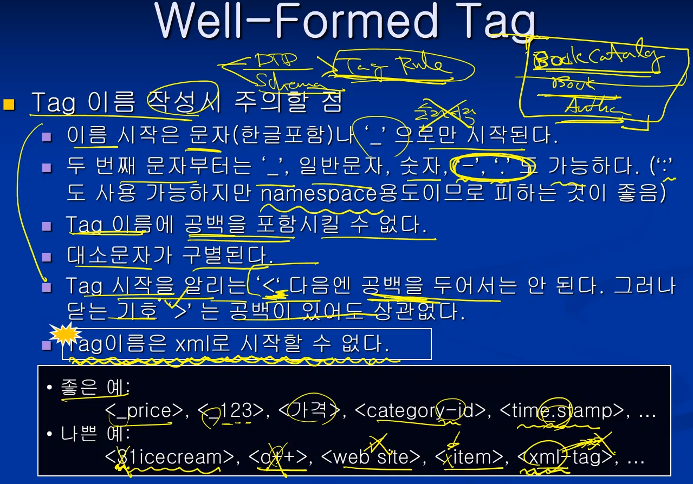
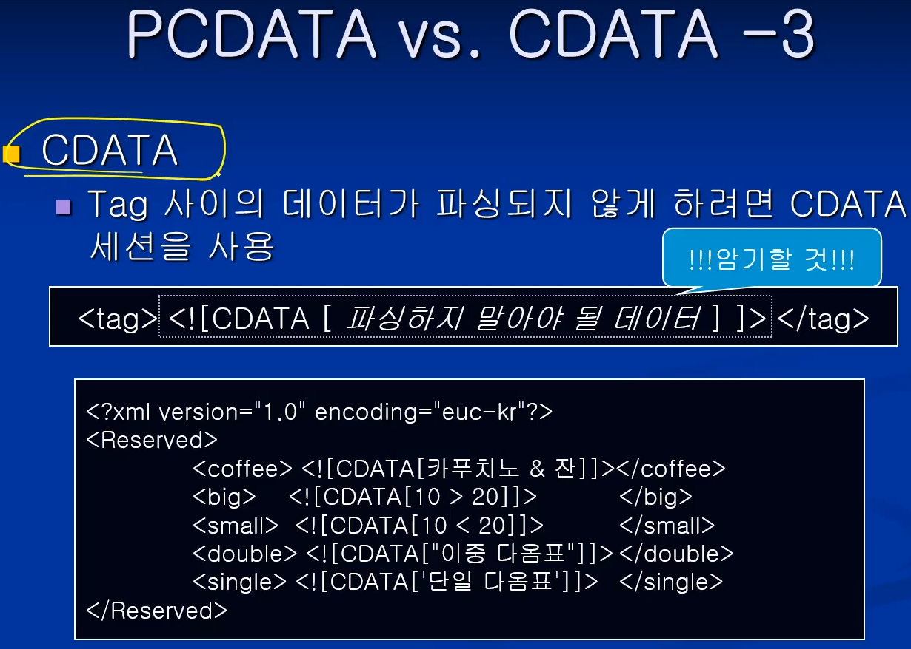

# 웹정보 프레임워크

<br/>

## 1주차, Introduction

### HTML의 문제점

* 문서의 구조나 의미(content)보다는 표현(presentation) 부분에 중점
  * 문서 처리의 자동화가 어려움
* <**태그**> <**/태그**> 로 구성되어있는 것을 XML에서는 **element**라고 한다.
* XML에서는 태그 안에 해당 정보를 포함한다.


<br/>

### XML

* **eXtensible Markup Language** ★

* SGML : 가장 포괄적인 마크업 언어
* XML : SGML의 기능들을 뽑아내서 만든 부분집합.
  * 비유하자면, SGML과 XML은 자료형으로 볼 수 있다. int, long, ...
* HTML : SGML을 적용시켜서 만든 언어 (인스턴스)
  * 비유하자면, HTML은 자료형에 대한 변수로 볼 수 있다. value, sum ...
  * 따라서 언어 자체에 대해서 XML과 HTML은 '비교 대상'은 아니다.

<br/>

### XML vs SGML vs HTML


* 문법적인 면에서 더 엄격한 경우, 오히려 심플하다고 볼 수 있다.
* **XML은 namespace를 지원한다!** ★
  * XML은 태그set을 정의할 수 있다. 
  * 그런데, 그것이 중복되지 않아야 해서 그 set을 구분하기 위해서 쓰는 것을 말한다.
  * Java를 예로들면 같은 이름의 class가 다른 것을 구분하기 위해 package 개념이 있듯

<br/>

**★ 암기★**


* 위에는 HTML, 아래는 XML의 속성값 표현 예시.
* **XML은 HTML과 다르게 태그 Set을 정의하여 사용 가능! ★**

<br/>

### XML의 장점


* **문서의 내용과 스타일을 분리하여 기술한다!** ★
  * 스타일은 css 와 같은 보여지는, presentation 부분

<br/>

### XML의 용도


* **문서로서의 기능과, XML이 국제 표준이기 때문에 OS 등이 달라도 시스템간 자료로서의 기능 또한 수행할 수 있다. ★**

<br/>

### XML 관련 도구


<br/>

### XML Overview


* Prolog
  * XML 문서 선언문 ( <?xml version="1.0" ... ?> ) 필수
  * PI 선택
  * DTD 선택
* Body
  * root element 태그 필수로 하나만 존재
  * content 루트 안의 내용들을 말함

* **위 문서의 구조는 ★ 암기사항 ★**

<br/>


* DTD는 내부/외부 Schema는 외부에만
* **Body 부분은 최상위 root element 하나만 나온다. ★**

<br/>


* 첫 줄 외우자! 버전까지는 반드시 나온다. 인코딩은 옵션.
* Prolog에서 PI는 생략된 코드. PI나 DTD는 생략 가능.
* students가 body의 root element

<br/>

### 실습 ex1-1)

* encoding="euc-kr" : ANSI 인코딩 형식
* encoding="utf-8" : 보편적인 한글 지원 인코딩 형식 
* 실제 코딩한 방식과 저장한 방식 선택이 같아야 한다

<br/>


<br/>

* 브라우저로 열어본 모습


* HTML과 다르게 XML은 보여지는 것보다 **'정보'를 표시하는 '형식'에 더 관심이 있는 언어**이기 때문에 이쁘게 나오지 않는 것이다!

<br/>

<br/>

## 2주차

<br/>

* 암기★


* Well-Formed XML 문서 ★
  * XML 1.0 표준안에 최소한의 규칙(기본 syntax)을 지키는 문서 ★
  * 다른 언어로 따지면 '컴파일 오류가 발생하지 않는 문서'
* Valid XML 문서 ★
  * Well-Formed에서 좀 더 진화한 형태. (Well-formed를 포함)
  * 사용자가 정의(user defined rule)한 DTD나 Schema의 규칙도 지키는 문서 ★

<br/>

### XML 인코딩

* XML은 Text 기반 Markup Language.
  * 문자 저장을 위한 encoding 방식을 XML 선언문에 직접 기술해야 함
* 여러 코드 체계
  * ASCII : 7bit (사실상 8bit)
  * EBCDIC : 8bit
    * IBM 등에서 사용
  * ISO-8859-1 : 8bit
    * 서유럽 문자 집합
  * EUC-KR : ASCII 문자들을 1byte로 표현 / 한글, 일어 등은 2byte로 표현
    * 나라마다 고유한 코드 체계임. 따라서 따로 설치해줘야 깨지지 않고 열어볼 수 있음.
    * 결국 전 세계적으로 호환되는 것은 unicode.

<br/>

### XML 인코딩 -2


* 반복하지만, 외우자. <?xml version="1.0" encoding="EUC-KR"?>
  * encoding 은 생략 가능. 생략시 default값은 UTF-8

<br/>

### 유니코드


* 유니코드의 경우, 문자 하나를 2바이트로 저장한다.
  * 따라서 알파벳의경우 앞에 0을 다 붙여줘야 해서, 메모리가 2배가 된다.
  * 그러다보니 알파벳 문화권에 있던 친구들이 메모리 낭비라고 생각해서 꼼수를 부렸음.
  * 표준안을 좀 바꿔서, 저장하는 방식을 나눴음. 그게 바로 UTF-8, UTF-16 등임
* UTF-8
  * 가변방식. ASCII 문자는 1byte로, 나머지는 2~6byte로 저장
  * 기존의 ASCII 코드체계와 호환이 되므로 기본적인 인코딩으로 보통 지정함
* UTF-16
  * 고정방식. ASCII 문자 포함하여 모든 문자를 2byte로 저장

### <br/>실습 ex1-2)

* encoding="euc-kr" : ANSI 인코딩 형식
* encoding="utf-8" : 보편적인 한글 지원 인코딩 형식 
* 실제 코딩한 방식과 저장한 방식 선택이 다르면 제대로 안나오는 걸 확인해보는 실습

<br/>


<br/>

* 브라우저로 열어본 모습


* 인코딩 형식이 다르므로 깨져서 나오는 것을 확인할 수 있다.

<br/>

## Chapter 2

### Well-Formed XML Document

<br/>

### Well-Formed XML 문서 규칙

* Well-Formed 하다? ★
  * XML 1.0 표준안에 정의된 문법 규칙을 따르는 것
* Well-Formed XML 문서의 요구사항 ★
  * 시작 Tag와 끝 Tag가 일치해야 한다
  * Root element는 오직 하나만 존재해야 한다
  * 태그 지정 시 대소문자를 구분한다.
  * 하부 요소는 중첩하여 사용할 수 없다. (무조건 parent - child. cross-over 불가)
  * 속성값은 반드시 "", '' 를 사용해야 한다.
  * 하나의 element에서 attribute를 반복하여 사용해서는 안된다.

<br/>

### Well-Formed XML Element


* Element
  * XML 문서의 내용을 이루는 기본 단위가 된다.
  * HTML처럼 끝 태그를 생략할 수 없다. 반드시 시작 Tag, 끝 Tag 쌍으로 써야한다

<br/>

```xml
예시)

<?xml version="1.0" encoding="euc-kr"?>
<Product>
	<ID>19-908-098</ID>
	<Name>NoteBook</Name>
	<Price>2250000</Price>
</Product>
```

* 부모 element인 Product가 ID, Name, Price등을 자식 element로 가진다.
* Tree 구조처럼 생각하면 될 듯 하다.

<br/>

* 반복!! Root element가 여러 개여서는 안된다. 에러 예시.

```xml
...
<Product>
	...
</Product>
<Product>
	...
</Product>
```

<br/>

* 태그는 중첩할 수 없다. 에러 예시!!

```xml
...
<Product>
	<ID> ... <CategoryID> ... </ID> <CategoryID>
</Product>
```

<br/>

### 실습 2-1) Well-Formed 규칙을 따르는 XML 문서 만들기

* 도서 목록을 XML 문서로 작성하시오.
  * 도서 목록(BookCatalog)는 여러 개(4~5)의 책(Book)을 가진다.
  * 책(Book)은 제목(Title), 저자(Author), 출판년도(Year)에 대한 정보(하위 요소)를 가진다.


<br/>


<br/>

### Well-Formed XML Tag



* Tag 이름 작성시 주의할 점 (위와 같이, 변수 이름 짓는 것과 비슷)
  * 시작은 문자(한글포함), '_' 로만 시작
  * 두 번째 문자부터는 일반 문자, '_', 숫자, '-', '.'도 가능 (태그 이름으로 :는 피하는게 좋다)
  * Tag이름에 공백 불가
  * 대소문자 구분
  * '<' 다음엔 공백 불가, '>' 전에는 공백 가능
  * Tag이름은 xml로 시작할 수 없다 ★

<br/>

### Well-Formed XML Attribute


* 속성(Attribute)?
  * Element에 부가적인 정보를 추가할 때 사용
  * attritube 이름, 'value' 가 쌍으로 생략되지 않고 나와야 한다.
  * value는 따옴표로 반드시 감싸줘야 한다.

<br/>

* Attribute 작성 규칙
  * 속성은 시작 Tag에서 지정해준다.
  * 속성은 속성 이름과 속성 값이 한 쌍으로 이루어져야 한다.
    * 속성값은 반드시 값을 가져야 한다. \<Name nickname> X
  * 속성값은 반드시 단일 따옴표나 이중 따옴표로 둘러싸야 한다.
    * \<People ID=691112-1683141 age=22> X
    * \<Song title="Alice's home"> O
  * 한 Tag내에 같은 속성을 두 번 이상 지정할 수 없다.
    * \<Name nickname="bear" nickname="tiger"> X

<br/>

### Well-Formed XML Comment


* 주석 형식
  * \<!-- 하이픈을 제외하고 아무거나 적어도 됨 --> 외우자! ★

<br/>

### Empty Element


* content가 없는 태그의 경우 '축약'해서 쓸 수 있다.
  * 끝 태그가 없는 것이 아니라 '축약'된 형태인 것!!

<br/>

### XML 문서의 선언

`

* 필수사항과 선택사항. version까지는 필수사항이므로 꼭 기억하자

<br/>

### Processing Instruction


* 외부 프로그램에게 알려주는 문장.
* 따라서 직접적으로 내부 내용과는 관련이 없다.

<br/>

### PCDATA vs. CDATA


* 문자열을 표현하는 것이라고 생각하면 된다. 다만 차이가 조금 있음.
* 일반 문자열의 경우에는 기본적으로 PCDATA라고 생각하면 된다.
* PCDATA
  * XML 파서가 해석할 수 있는 문자형 데이터를 말함
    * <, >, &, ", ' ... 등 의미가 부여되는 기호는 허용되지 않음
    * 이런 문자들은 &nbsp 처럼 entity reference로 기술해야 한다.
* CDATA
  * XML 파서에 의해 파싱되지 않는 데이터를 말함
    * 의미 부여가 되지 않으므로, 특수한 기호들도 마찬가지로 얼마든지 사용 가능
    * 단, 시작과 끝을 CDATA로 별도 표기해주어야 한다.

<br/>


<br/>



* 암기할 것!! ★

```xml
<tag><![CDATA[  파싱하지  말아야  될  데이터  ]]><tag>
```


<br/>

namespace

<br/>

