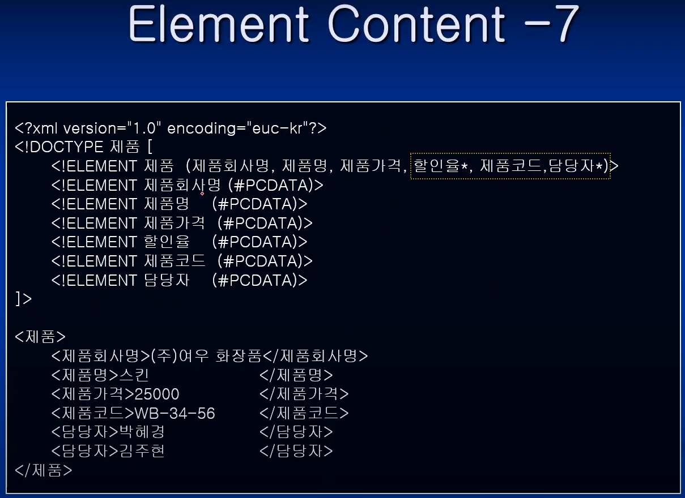
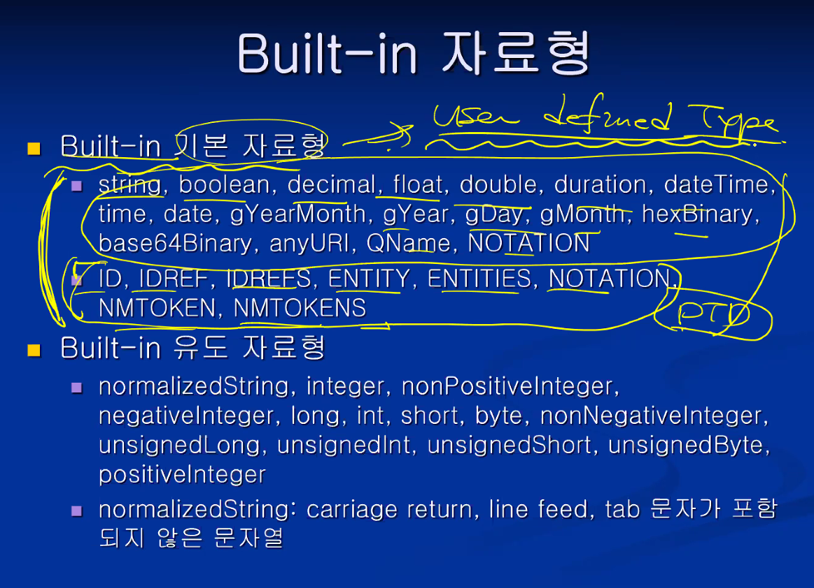
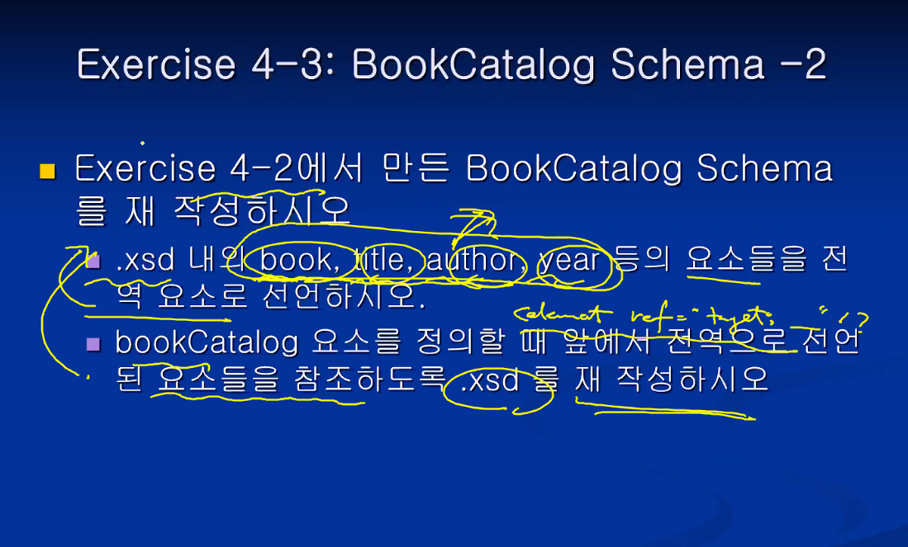
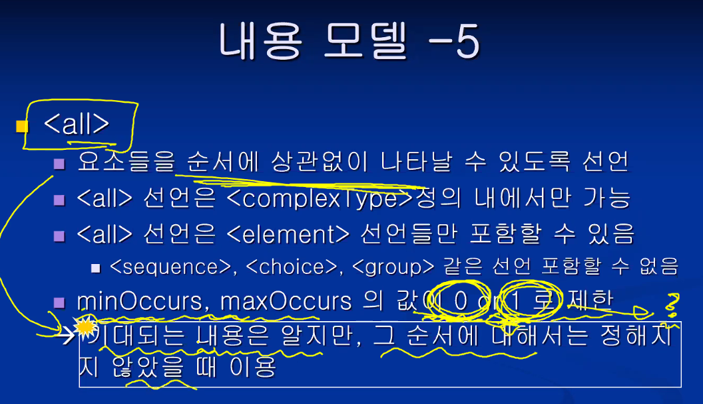
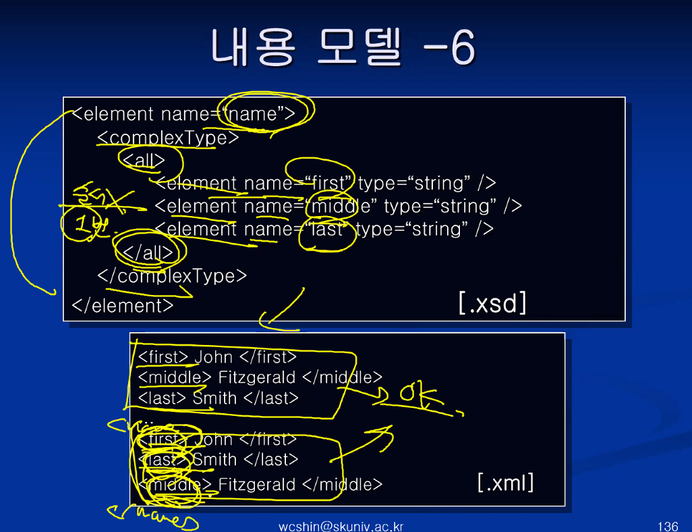
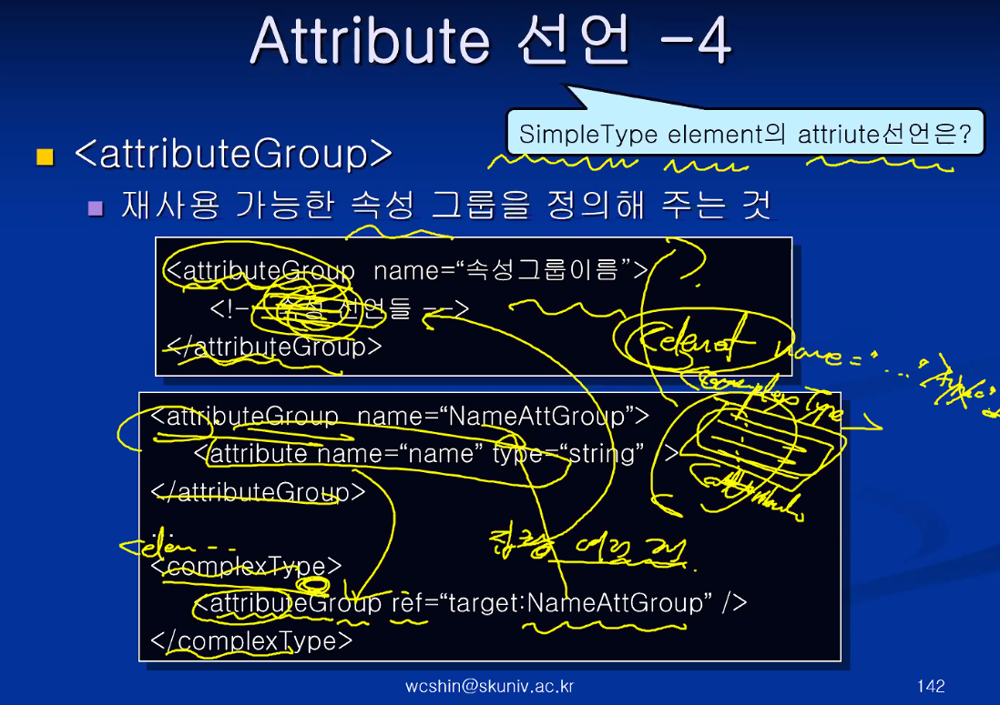
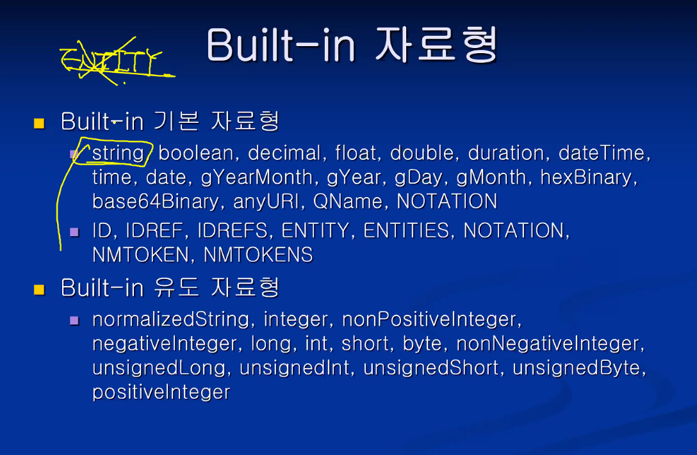

# 웹정보 프레임워크

<br/>

## Chapter 1, Introduction

### HTML의 문제점

* 문서의 구조나 의미(content)보다는 표현(presentation) 부분에 중점
  * 문서 처리의 자동화가 어려움
* <**태그**> <**/태그**> 로 구성되어있는 것을 XML에서는 **element**라고 한다.
* XML에서는 태그 안에 해당 정보를 포함한다.


<br/>

### XML

* **eXtensible Markup Language** ★

* SGML : 가장 포괄적인 마크업 언어
* XML : SGML의 기능들을 뽑아내서 만든 부분집합.
  * 비유하자면, SGML과 XML은 자료형으로 볼 수 있다. int, long, ...
* HTML : SGML을 적용시켜서 만든 언어 (인스턴스)
  * 비유하자면, HTML은 자료형에 대한 변수로 볼 수 있다. value, sum ...
  * 따라서 언어 자체에 대해서 XML과 HTML은 '비교 대상'은 아니다.

<br/>

### XML vs SGML vs HTML


* 문법적인 면에서 더 엄격한 경우, 오히려 심플하다고 볼 수 있다.
* **XML은 namespace를 지원한다!** ★
  * XML은 태그set을 정의할 수 있다. 
  * 그런데, 그것이 중복되지 않아야 해서 그 set을 구분하기 위해서 쓰는 것을 말한다.
  * Java를 예로들면 같은 이름의 class가 다른 것을 구분하기 위해 package 개념이 있듯

<br/>

**★ 암기★**


* 위에는 HTML, 아래는 XML의 속성값 표현 예시.
* **XML은 HTML과 다르게 태그 Set을 정의하여 사용 가능! ★**

<br/>

### XML의 장점


* **문서의 내용과 스타일을 분리하여 기술한다!** ★
  * 스타일은 css 와 같은 보여지는, presentation 부분

<br/>

### XML의 용도


* **문서로서의 기능과, XML이 국제 표준이기 때문에 OS 등이 달라도 시스템간 자료로서의 기능 또한 수행할 수 있다. ★**

<br/>

### XML 관련 도구


<br/>

### XML Overview


* Prolog
  * XML 문서 선언문 ( <?xml version="1.0" ... ?> ) 필수
  * PI 선택
  * DTD 선택
* Body
  * root element 태그 필수로 하나만 존재
  * content 루트 안의 내용들을 말함

* **위 문서의 구조는 ★ 암기사항 ★**

<br/>


* DTD는 내부/외부 Schema는 외부에만
* **Body 부분은 최상위 root element 하나만 나온다. ★**

<br/>


* 첫 줄 외우자! 버전까지는 반드시 나온다. 인코딩은 옵션.
* Prolog에서 PI는 생략된 코드. PI나 DTD는 생략 가능.
* students가 body의 root element

<br/>

### 실습 ex1-1)

* encoding="euc-kr" : ANSI 인코딩 형식
* encoding="utf-8" : 보편적인 한글 지원 인코딩 형식  
* 실제 코딩한 방식과 저장한 방식 선택이 같아야 한다

<br/>


<br/>

* 브라우저로 열어본 모습


* HTML과 다르게 XML은 보여지는 것보다 **'정보'를 표시하는 '형식'에 더 관심이 있는 언어**이기 때문에 이쁘게 나오지 않는 것이다!

<br/>

<br/>

* **암기★**


* Well-Formed XML 문서 ★
  * XML 1.0 표준안에 최소한의 규칙(기본 syntax)을 지키는 문서 ★
  * 다른 언어로 따지면 '컴파일 오류가 발생하지 않는 문서'
* Valid XML 문서 ★
  * Well-Formed에서 좀 더 진화한 형태. (Well-formed를 포함)
  * 사용자가 정의(user defined rule)한 DTD나 Schema의 규칙도 지키는 문서 ★

<br/>

### XML 인코딩

* XML은 Text 기반 Markup Language.
  * 문자 저장을 위한 encoding 방식을 XML 선언문에 직접 기술해야 함
* 여러 코드 체계
  * ASCII : 7bit (사실상 8bit)
  * EBCDIC : 8bit
    * IBM 등에서 사용
  * ISO-8859-1 : 8bit
    * 서유럽 문자 집합
  * EUC-KR : ASCII 문자들을 1byte로 표현 / 한글, 일어 등은 2byte로 표현
    * 나라마다 고유한 코드 체계임. 따라서 따로 설치해줘야 깨지지 않고 열어볼 수 있음.
    * 결국 전 세계적으로 호환되는 것은 unicode.

<br/>

### XML 인코딩 -2


* 반복하지만, 외우자. \<?xml version="1.0" encoding="EUC-KR"?>
  * encoding 은 생략 가능. 생략시 default값은 UTF-8

<br/>

### 유니코드


* 유니코드의 경우, 문자 하나를 2바이트로 저장한다.
  * 따라서 알파벳의경우 앞에 0을 다 붙여줘야 해서, 메모리가 2배가 된다.
  * 그러다보니 알파벳 문화권에 있던 친구들이 메모리 낭비라고 생각해서 꼼수를 부렸음.
  * 표준안을 좀 바꿔서, 저장하는 방식을 나눴음. 그게 바로 UTF-8, UTF-16 등임
* UTF-8
  * 가변방식. ASCII 문자는 1byte로, 나머지는 2~6byte로 저장
  * 기존의 ASCII 코드체계와 호환이 되므로 기본적인 인코딩으로 보통 지정함
* UTF-16
  * 고정방식. ASCII 문자 포함하여 모든 문자를 2byte로 저장

### <br/>실습 ex1-2)

* encoding="euc-kr" : ANSI 인코딩 형식
* encoding="utf-8" : 보편적인 한글 지원 인코딩 형식 
* 실제 코딩한 방식과 저장한 방식 선택이 다르면 제대로 안나오는 걸 확인해보는 실습

<br/>


<br/>

* 브라우저로 열어본 모습


* 인코딩 형식이 다르므로 깨져서 나오는 것을 확인할 수 있다.

<br/>

## Chapter 2

### Well-Formed XML Document

<br/>

### Well-Formed XML 문서 규칙

* Well-Formed 하다? ★
  * XML 1.0 표준안에 정의된 문법 규칙을 따르는 것
* Well-Formed XML 문서의 요구사항 ★
  * 시작 Tag와 끝 Tag가 일치해야 한다
  * Root element는 오직 하나만 존재해야 한다
  * 태그 지정 시 대소문자를 구분한다.
  * 하부 요소는 중첩하여 사용할 수 없다. (무조건 parent - child. cross-over 불가)
  * 속성값은 반드시 " " 또는 ' ' 를 사용해야 한다.
  * 하나의 element에서 attribute를 반복하여 사용해서는 안된다.

<br/>

### Well-Formed XML Element


* Element
  * XML 문서의 내용을 이루는 기본 단위가 된다.
  * HTML처럼 끝 태그를 생략할 수 없다. 반드시 시작 Tag, 끝 Tag 쌍으로 써야한다

<br/>

```xml
예시)

<?xml version="1.0" encoding="euc-kr"?>
<Product>
	<ID>19-908-098</ID>
	<Name>NoteBook</Name>
	<Price>2250000</Price>
</Product>
```

* 부모 element인 Product가 ID, Name, Price등을 자식 element로 가진다.
* Tree 구조처럼 생각하면 될 듯 하다.

<br/>

* 반복!! Root element가 여러 개여서는 안된다. 에러 예시.

```xml
...
<Product>
	...
</Product>
<Product>
	...
</Product>
```

<br/>

* 태그는 중첩할 수 없다. 에러 예시!!

```xml
...
<Product>
	<ID> ... <CategoryID> ... </ID> <CategoryID>
</Product>
```

<br/>

### 실습 2-1) Well-Formed 규칙을 따르는 XML 문서 만들기

* 도서 목록을 XML 문서로 작성하시오.
  * 도서 목록(BookCatalog)는 여러 개(4~5)의 책(Book)을 가진다.
  * 책(Book)은 제목(Title), 저자(Author), 출판년도(Year)에 대한 정보(하위 요소)를 가진다.


<br/>

* 웹 브라우저로 본 모습


<br/>

### Well-Formed XML Tag


* Tag 이름 작성시 주의할 점 (위와 같이, 변수 이름 짓는 것과 비슷)
  * 시작은 문자(한글포함), '_' 로만 시작
  * 두 번째 문자부터는 일반 문자, '_', 숫자, '-', '.'도 가능 (태그 이름으로 :는 피하는게 좋다)
  * Tag이름에 공백 불가
  * 대소문자 구분
  * '<' 다음엔 공백 불가, '>' 전에는 공백 가능
  * Tag이름은 xml로 시작할 수 없다 ★

<br/>

### Well-Formed XML Attribute


* 속성(Attribute)?
  * Element에 부가적인 정보를 추가할 때 사용
  * attritube 이름, 'value' 가 쌍으로 생략되지 않고 나와야 한다.
  * value는 따옴표로 반드시 감싸줘야 한다.

<br/>

* Attribute 작성 규칙
  * 속성은 시작 Tag에서 지정해준다.
  * 속성은 속성 이름과 속성 값이 한 쌍으로 이루어져야 한다.
    * 속성값은 반드시 값을 가져야 한다. \<Name nickname> X
  * 속성값은 반드시 단일 따옴표나 이중 따옴표로 둘러싸야 한다.
    * \<People ID=691112-1683141 age=22> X
    * \<Song title="Alice's home"> O
  * 한 Tag내에 같은 속성을 두 번 이상 지정할 수 없다.
    * \<Name nickname="bear" nickname="tiger"> X

<br/>

### Well-Formed XML Comment


* 주석 형식
  * \<!-- 하이픈을 제외하고 아무거나 적어도 됨 --> 외우자! ★

<br/>

### Empty Element


* content가 없는 태그의 경우 '축약'해서 쓸 수 있다.
  * 끝 태그가 없는 것이 아니라 '축약'된 형태인 것!!

<br/>

### XML 문서의 선언

* 필수사항과 선택사항. version까지는 필수사항이므로 꼭 기억하자

<br/>

### Processing Instruction


* 외부 프로그램에게 알려주는 문장.
* 따라서 직접적으로 내부 내용과는 관련이 없다.

<br/>

### PCDATA vs. CDATA


* 문자열을 표현하는 것이라고 생각하면 된다. 다만 차이가 조금 있음.
* 일반 문자열의 경우에는 기본적으로 PCDATA라고 생각하면 된다.
* PCDATA
  * XML 파서가 해석할 수 있는 문자형 데이터를 말함
    * <, >, &, ", ' ... 등 의미가 부여되는 기호는 허용되지 않음
    * 이런 문자들은 &nbsp 처럼 entity reference로 기술해야 한다.
* CDATA
  * XML 파서에 의해 파싱되지 않는 데이터를 말함
    * 의미 부여가 되지 않으므로, 특수한 기호들도 마찬가지로 얼마든지 사용 가능
    * 단, 시작과 끝을 CDATA로 별도 표기해주어야 한다.

<br/>


<br/>


* 암기할 것!! ★

```xml
<tag><![CDATA[  파싱하지  말아야  될  데이터  ]]><tag>
```

<br/>

### 실습 2-3) CDATA 응용 북 카테고리 만들기

* xml 코드


<br/>

* 웹 브라우저로 본 모습


<br/>

### namespace ★


* Java에서 class 이름의 중복을 막기 위해 Package 개념을 도입한 것과 비슷하다.
* 여러 XML 문서 내용을 합칠 때 발생 가능한, 요소들의 이름 충돌을 막기 위한 기술

<br/>


* 위 예시의 경우, 상위 ID는 User를 위한 태그고 하위 ID는 Product를 위한 태그지만, 이름이 같아 충돌이 일어난다.

<br/>


* 임시로 쓰이는 별명을 접두사로 붙인다.
* 너무 긴 namespace를 매번 붙이기 번거로우니까 도입
  * Namespace:이름 - 고유성 보장
  * Prefix:이름 (별명) - 편리성
* xmlns(xml namespace)
* 임의의 문자열로 Unique 하기만 하면 되지만, 권장사항으로 URL로 해야 실질적으로 충돌이 발생할 가능성이 낮아 많이 사용한다. 
* "" 비어있는 URL로 한다면, namespace가 없는 녀석으로 인식한다.

<br/>


* 처음 사용하기 전에는 선언을 한 번 해주어야 한다.
* 시작 태그에 써준 별명은 반드시 끝 태그에도 써주어야 한다.
* prefix가 달라도 namespace URL 주소가 같으면 결국 같은 녀석으로 본다.
* URL 내용이 비어있으면, namespace가 없는 녀석으로 인식한다.

<br/>

### 실습 2-4) Namespace 정의

* 실습 2-1) 에서 작성한 BookCatalog.xml에서 Namespace를 정의하여 각 요소들 이름에 지정

* xml 코드


<br/>

* 웹 브라우저로 본 모습


<br/>


* xmlns:prefix 가 존재하지 않음 (기본적으로는 반드시 써주어야 함)
  * default namespace라고 함.
  * 선언된 시작 태그부터 하위의 모든 태그들은 해당 namespace를 사용

<br/>


* Namespace는 해당 요소 및 자손 요소들까지 적용.
* Default Namespace는 가까운 쪽에 선언된 것이 적용된다.
  * 위의 경우 상위 ID는 User에 선언된 namespace가, 하위 ID는 Product에 선언된 namespace가 적용 된다.

<br/>


<br/>

## Chapter 3. Valid XML Document

### 복습

* well formed XML DOC : 최소한의 규칙을 지키는 XML 문서
* Valid XML Document : well formed + user defined Rule 만족하는 XML 문서
  * Tag set 정의하는 방법
    * DTD (초기에 나온 방법)
    * XML Schema

<br/>

### XML 문서의 표준화


<br/>


* 위와 같은 그림 모델을 실제 규칙으로, DTD로 어떻게 작성할 것이냐? 를 이제 살펴볼 것!

<br/>

### DTD 필요성


* DTD : Document Type Definitions
* Valid 문서의 두 가지 조건 ★
  * Well-Formed XML 문서여야 함
  * DTD or XML Schema에 따라 XML 문서가 만들어져야 함

<br/>

### DTD 선언하기 ★ 암기


* \<!DOCTYPE 공백 없이 붙이기, 대소문자 구분, 반드시 root element 이름 [
* 내부 <!ELEMENT 부분이 바로 DTD 규칙이며, XML이 아닌 DTD 문법을 따른다.
* 외워야 합니다! 위 양식 암기부분 ★

<br/>

### 유효성 검증하기

* 웹 브라우저는 well formed만 검사하고, valid는 검사 못함
  * XML 파서가 필요하다.
  * 직접 다운로드 해서 설치하기!
  * 설치 후 웹 빈공간 우클릭 - validate XML

<br/>

### DTD Overview


* XML 문서 내부 DTD 정의 형식 외우기! ★

  * ```xml
    <!DOCTYPE RootElementName [
    	DTD 내용
    ]>
    ```

  * 따지고 보면 [ ] 대괄호 사이의 DTD 내용만 DTD syntax 이다.

  * 그 외 위 아래에 기술되어 있는 내용은 DTD가 아니다.

<br/>

### Element 선언


* 내부 DTD의 경우!

<br/>

#### 5가지 요소 유형 암기사항! ★  

* 내용이 없는 Empty Element 선언

  * ```XML
    <!ELEMENT 요소이름 EMPTY>
    ```

  * EMPTY에 괄호 없음, 대문자

* 내용에 텍스트를 갖는 Element 선언

  * ```XML
    <!ELEMENT 요소이름 (#PCDATA)>
    ```

  * 괄호 열고, 대문자

* 내용에 하위요소를 갖는 Element 선언

  * ```XML
    <!ELEMENT 요소이름 (자손요소리스트)>
    ```

  * ( , , ... , , )

* 내용에 혼합 내용 모델을 갖는 Element 선언

  * ```XML
    <!ELEMENT 요소이름 MIXED모델>
    ```

* 내용에 모든 것(아무것)을 갖는 Element 선언

  * ```XML
    <!ELEMENT 요소이름 ANY>
    ```

  * 괄호 없음, 대문자

<br/>

### 다시 복습 DTD의 ELEMENT 선언하는 다섯가지 유형 ★

1. EMPTY
2. (#PCDATA)
3. ANY
4. (, , , )
5. MIXED 모델

<br/>

### Element Content - Empty element


<br/>

### Element Content - 하위 요소 element


<br/>


* 아래 내용이 DTD에 Valid 하다!

<br/>

### 실습 3-2) DTD 작성하기

* DTD 작성 코드


<br/>

* 유효성 검사 Validation successful!


<br/>

### Element Content - 하위 요소 지정 방식


<br/>


* 아래 내용이 DTD에 Valid 하다!

<br/>



* 아래 내용이 DTD에 Valid 하다!

<br/>

### Element Content - MIXED 모델


* 문자열과 하위 Element들이 여러 번 나오는 경우

* 양식 암기 ★

  * ```xml
    <!ELEMENT 요소이름 (#PCDATA | child1 | child2)*>
    ```

    * () 괄호 안에, #PCDATA가 가장 먼저 나오고 |로 구분, 괄호 밖에 마지막에 * 붙이기

<br/>


* 아래 내용이 DTD에 Valid 하다!

<br/>

### Element Content - ANY


<br/>


* 아래 내용이 DTD에 Valid 하다!

<br/>

### 실습 3-3) DTD 작성하기 - 2

* 작성 코드


<br/>

* 실행 결과


<br/>

#### 4주차 수업

* xsl 자동으로 동작..! XML이 아닌 것 처럼 동작함... 그래서 익스플로러에서 xml이 valid 안되는 경우가 있음

* DTD에서 속성이름에 ? 붙이는 것 : 해당 태그 생략가능

<br/>

### 외부 DTD

<br/>


* \<!DOCTYPE ... > 문장 제외하고 내부의 \<!ELEMENT ... > 선언 부분만 DTD 이다.
* 이 부분을 **따로 저장하면 이것이 바로 외부 DTD**. 아래 문장을 통해서 외부 DTD를 사용할 수 있다.
* **\<!DOCTYPE root요소이름 SYSTEM "파일명.dtd">**  (대소문자 구분)
* DTD는 내부에도 선언 가능하고, 외부에도 선언 가능 하지만, 뒤에서 배울 Schema는 외부로만 가능하다!

<br/>

### 실습 3-4) 외부 DTD 파일 만들기

* 작성 코드

```xml-dtd
<!ELEMENT BookCode (#PCDATA)>
<!ELEMENT Title (#PCDATA)>
<!ELEMENT Author (#PCDATA)>
<!ELEMENT CoAuthor (#PCDATA | Author)*>
<!ELEMENT Year (#PCDATA)>
<!ELEMENT Summary ANY >
<!ELEMENT Price ANY >
```

<br/>

* 외부 DTD를 선언하였으므로, 내부에는 작성하지 않는다.


<br/>

* 한글을 쓴 경우, "euc-kr" 방식으로 인코딩을 하고 싶을 때만 선언부를 포함한다.


<br/>

### Attribute 선언


* Attribute의 문법은 **\<!ATTLIST 요소이름 속성이름 속성유형 속성기본값>** 형태를 가진다. **암기 ★**
* Attribute 유형은 속성이 가질 수 있는 값의 타입을 말한다.
* Element에서는 **#PCDATA**가 기본이었으나, **Attibute**의 기본 타입은 **CDATA**가 기본이다.

<br/>

#### Built-in

```xml-dtd
<!ATTLIST 요소이름 속성이름 {속성유형} 속성기본값> 에서 속성 유형에 따른 속성값의 타입
```

* CDATA 일 때 속성값 : '문자열'
* ID 일 때 속성값 : '식별자'
* IDREF 일 때 속성값 : '식별자' reference
* IDREFS 일 때 속성값 : 여러 개의 '식별자' reference 들
* NMTOKEN 일 때 속성값 : 문법적 제한이 있는 'Token'
* NMTOKENS 일 때 속성값 : 여러 개의 'Token' 들
* ENTITY 일 때 속성값 : 'Entity'
* ENTITIES 일 때 속성값 : 여러 개의 'Entity' 들
  * 해당 차이들을 잘 인지하고 있음 된다.

<br/>


* 속성 기본 값은 넣어주지 않을 때 기본으로 들어가는 Default값을 말함
* 예시 **암기 ★**

<br/>

### 실습 3-5) Attribute 선언하기

* .dtd 파일에서 Book 요소 속성으로 lang 만들기
  * 속성유형 : 문자열 (CDATA)
* .xml 파일의 Book 요소에 lang 속성 넣고 valid 검사하기

```xml-dtd
<!ATTLIST Book lang CDATA "ko">
```

```xml
<Book lang="ko">
	...
</Book>
<!-- valid successful -->
```

<br/>

* DTD는 **ELEMENT** 선언과 **ATTLIST** 선언, **ENTITY** 선언 세 가지를 알면 다 아는 것이다!

<br/>


#### 속성값 Option

* 따로 없으면, **입력 안할 시 default**로 줄 속성값 / **생략 가능**
* **#FIXED** 속성값 : 무조건 해당 속성값 **고정**. 다른 값 입력시 invalid! (**예 : xml version="1.0"**) / **생략 가능**
  * 의미상으로 속성값을 고정으로 주는것이다.
* **#IMPLIED** : 무시 가능한 속성. 입력 하지 않으면 생략할 수 있다! / **생략 가능**
  * 의미상으로 속성값을 주는게 아니다.
* **#REQUIRED** : 미입력시 invalid! 반드시 값을 지정해 주어야 한다! / **생략 불가**
  * 의미상으로 속성값을 주는게 아니다.

<br/>

### 실습 3-6) 속성 기본값 Option

* .dtd 파일에서 lang 속성값을 #FIXED, #IMPLIED, #REQUIRED로 넣고 각각 빈칸, 임의의 값 등을 넣어보기
* .xml 파일의 Book 요소에 lang 속성 넣고 valid 검사하기


<br/>

* 작성 코드


* #FIXED의 경우
  * 값 생략 가능 - 생략 시 FIXED 값으로 들어감
  * 다른 값 넣으면 Error 발생 (invalid)


<br/>

* #IMPLIED
  * 값 생략 및 임의의 값 모두 가능


<br/>

* REQUIRED
  * 값 생략시 Error 발생 (invalid)


<br/>


* ID의 경우 Unique 해야한다! (= 중복 될 수 없다. 하나만 존재)
* 따라서 Default 값을 줄 수 없다. 반드시 뒤에 **#IMPLIED**, **#REQUIRED** 가 나와야 한다.
  * 아예 생략하거나, 반드시 하나만 필요하다.
* **숫자**나 '/' 등의 문자가 있으면 안된다. 변수 선언과 비슷함

<br/>

### 실습 3-7) Attribute - ID 속성값

* .dtd 파일에서 Book 요소의 속성으로 code를 작성. 속성유형은 ID로.
* .xml 파일의 Book 요소들 code 속성값을 중복시켜보고, #IMPLIED or #REQUIRED 생략해보기, 공백 넣어보기

<br/>

* 작성 코드

```xml-dtd
<!ATTLIST Book code ID #IMPLIED>
<!ATTLIST Book code ID #REQUIRED>
```

<br/>

* code 속성 값 중복 시 Error (invalid)


<br/>

* #IMPLIED or #REQUIRED 생략 시 Error (invalid)


<br/>

* 공백 포함 시 Error (invalid)


<br/>


* 다시 말하지만, **ID는 중복이 될 수 없다**.
* 하지만 IDREF는 중복 가능하다. 앞서 만든 ID를 Refference 하는 것!
* 따라서 **이미 존재하는 ID를 REF**해야한다. **없는 ID를 넣으면 invalid**!
* IDREF는 단수 개의 ID를 REF.한다

<br/>


* 복수 개를 표기한다. 속성값은 공백으로 구분한다.
* IDREFS는 복수 개의 ID를 REF한다

<br/>


<br/>


* 마찬가지로 변수 선언과 비슷하다.
* 공백을 포함하면 여러 개의 String으로 인지하므로 불가
* : 은 namespace로 사용하므로 비권장
* \<cover img="c://book.gif"> 에서 / 가 틀렸다!
* NMTOKEN은 단수, NMTOKENS는 복수개 가지는 것
* 이것 자체만은 별 의미가 없지만, 뒤에 Entity와 함께 쓰여 외부 어플에 정보를 전달할 때 사용한다.

<br/>


* CDATA도 아니고, ID도 아니고.. 열거된 해당 값만 가질 수 있다!
* (**원**, **달러**, **엔**) 이라는 값만 가능하다는 의미
* 프랑은 열거형에 나열된 값 중 존재하지 않으므로 가질 수 없다! Error!

<br/>

### 실습 3-8) Attribute 유형 - 열거형

* Book 요소의 하위요소로 Price 요소를 삽입, 속성으로 unit을 작성하고 열거형 (원/달러/엔/프랑)을 지정
* .xml 문서에서 unit에 속성값을 넣은 후 valid 검사

<br/>

* 작성 코드

```xml-dtd
<!ATTLIST Price unit (원 | 달러 | 엔 | 프랑) #IMPLIED>
```

<br/>

* 다른 값 "유로"를 넣었을 때 오류


<br/>

#### 앞서 공부한거 정리 해보자!

element 선언하는거!

```xml-dtd
<!ELEMENT element (EMPTY | #PCDATA | (child1, ...) | ANY | (#PCDATA | A | B)* )>
```

* \<!ELEMENT 태그이름 {유형} >
  * EMPTY
  * #PCDATA
  * (child1, child2, ... , child n) ...
  * ANY
  * MIXED : (#PCDATA | A | B)*

```xml-dtd
<!ATTLIST element att_name (CDATA | ID[REF[S]] | NMTKOEN[S] | 열거형) ("" | #IMPLIED | FIXED | REQUIRED)>
```

* \<!ATTLIST 태그이름 속성이름 {유형} 기본값 >
  * CDATA
  * ID[REF[S]]
  * NMTOKEN[S]
* \<!ATTLIST 태그이름 속성이름 유형 {기본값} >
  * "_____"
  * #IMPLIED
  * #FIXED
  * #REQUIRED

<br/>

### Entity


* 첫 번째 문자열 치환이 가장 많이 사용된다고 한다. - **#define** 하고 똑같은 방식
* 위 두개는 XML에서 쓰이고, 아래꺼는 DTD에서 쓰이는 것

<br/>


* DTD에서 정의하는 부분, XML에서 사용되는 부분
* XML에서 쓰이는 것은, **\&를 붙이고, 끝에 ;을 붙인다**.

<br/>


* 위의 경우, 치환될 문자열의 내용이 외부 파일에 매칭되는 것이다.
* xml 선언문은 UTF-8로 저장하면 굳이 안써줘도 상관 없다.

<br/>

#### 활용 예시

```xml-dtd
<?xml version="1.0" encoding="UTF-8"?>
<!DOCTYPE Memo [
  <!ELEMENT Memo (#PCDATA)>
  <!ENTITY 내생일날 "1997년 5월 9일">
]>
<Memo>
	내 생일은 &내생일날; 입니다.
</Memo>
```

<br/>

### 실습 3-9) Entity 선언과 이용

* dtd에 이름의 이니셜 entity를 작성하고, 이 entity를 xml 문서에서 이용하기
* \<author> 박상민 \</author>   =>   \<author> &psm; \</author>
* 이니셜Entity의 문자열을 외부 파일로 만들어서 이용하시오.

<br/>


* 파싱되지 않는 Entity는 & ; 없이 이름 그대로 **속성값**으로만 사용한다.
* 단순 문자열이 아니라, 이미지 파일의 이름과 노테이션이라는 것을 통해서, 처리할 프로그램 이름까지 매칭시켜준다.

<br/>


* 이전 두 가지와 다르게, 이건 DTD에서만 사용하는 것이다.
* % 퍼센트 붙는것, 빈칸, 선언 방식 이런식으로 한다~ 기억하면 됩니다.
* 사용할 때는 빈칸 없이 %붙여서 한다.

<br/>


* 아래꺼. DTD에서 쓸 것. DTD 선언 내에서 선언하고, DTD 선언 내에서 사용한다.
* #include랑 비슷한 것 같아.

<br/>

#### 다시 정리. 기억할 부분들!!

* **DTD** 다시 복습하며 정리하자
  1. \<!ELEMENT
     1. 다섯가지
  2. \<!ATTRIBUTE
     1. 몇가지
  3. \<!ENTITY
     1. 치환된 문자열 선언되는 것들

* DTD는 문법은 심플한데, 표현력이 떨어진다. 그래서 나온게 스키마!
* Schema는 더 파워풀하다! 즉, 기능이 많다. 대신 비교적 복잡하다.

<br/>


<br/>

## Chapter 4. Schema

<br/>


* 공부할 꺼 꽤 많아.. 교재도 좀 읽어보자..

<br/>

### Schema vs DTD


* **★ Schema의 장점! ★**
  * XML 문법을 따른다!! (DTD는 XML문법이 아니다) 
  * **Namespace**를 완전히 지원한다!! ★
* **반드시 구분하자!!**
  * **simpleType** : 속성 **값**(value)이나 텍스트만 포함하는 요소 ★
  * **complexType** : **속성**(attribute) 및 **다른 요소**(element)들을 포함하는 요소 ★

<br/>



* 미리 정의된 자료형들로, 기본 자료형을 사용자가 지정할 수도 있다. Schema가 DTD도 호환하기 위해 DTD 자료형도 지원하도록 만들어 놨다! 후에 다시 볼 페이지.

<br/>


* 단점
  * 표현력이 높은 대신 좀 복잡하다. DTD는
  * 권고안의 일부만 지원한다지만, 우리수준에선.. 다 가능
* DTD는 안쓰나?
  * 스키마는 Entity 기능을 제공 못하지만, DTD는 제공함!
  * DTD는 XML 파일 내부에도 포함 가능.
  * Schema는 무조건 외부에만 선언. 확장자는 (**.xsd**)

<br/>


* DOM은 XML을 위한 것. 그래서 DTD는 지원 안됨.
* DTD는 사실상 Namespace를 지원하지 않는다고 본다.
* 문서 하나에 하나의 DTD만 쓸 수 있지만, 스키마는 Namespace가 있기 때문에 여러개 가능!
* 동적 연결. 

<br/>

### XML Schema 맛보기


* 사각형 : **element** / 타원 : **attribute**
* 모든 XML Schema xsd 문서의 **root element**는 **schema** 여야 한다!
* name이라는 element를 선언해주고, 이것은 하위 **element**들을 가지는 **complexType**이다.
* sequence는 차례대로 한 번씩 element를 가진다는 의미이다.
* 하위 element 들은 string 이라는 built-in 타입을 가진다.

<br/>


* name이라는 root element에 하위 요소로 first, middle, last가 있는 것!
* name xmlns 부분은 일단 넘어가자.
* 아래 써놓은거는 이전 페이지 구조를 DTD로 선언 연습해본것.

<br/>


* **namespace**

  * **prefix가 없으면 해당 태그 하위 요소들에는 모두 default로 적용된다는 의미** ★

  * **스프링으로 타임리프 템플릿 사용할 때 써봤잖아 th:___ 이런식으로**

* **★ 중요 암기 ★**

  * **표준안에 대한 namespace** : **xmlns="http://www.w3.org/2001/XMLSchema"** ★
    * 반드시 위 주소 "그대로" 들어가야 한다. 철자 하나 틀림 없이
    * 기존에 미리 정의된 tag 이름인 element complexType ... 등은 w3c 표준안 그룹에서 만든 것들이다!
  * **targetNamespace** : **내가 정의**할 **tag set**들에 대해 어떤 그룹으로 지정할 것이냐를 정하는 것 ★
    * 새로 정의한 name, first, middle, last, title 등이 **http://www.wrox.com** 에 들어간다는 의미
    * 내 맘대로 뭘로 바꾸든 상관 없다. 개인 블로그든..
  * **xmlns:target** : 앞서 정의한 새로운 태그들을 스키마 안에서 다시 '사용하는' 경우가 있다.
    * 다시 사용하는 경우에는, prefix를 앞에 붙여주어야 한다. **target:first** 이런식으로!

* 다시 정리하는 **중요한 내용**은,
  * 첫 번째 표준안은, 스키마 xsd에 쓰이는 기본 tag set들이 소속된 namespace를 지정! 바꾸면 안됨.
  * 두 번째 targetNamespace는 내가 새로 정의하는 tag set 들에 대한 namespace!

<br/>


* 첫 번째 줄은 **targetNamespace**를 default namespace 지정해주는 코드  ★ **여기도 잘 이해하자** ★
  * **해당 tag가 어디에 소속되어있는지 적어준다.**
  * 그럼 하위 모든 요소들에 기본적으로 해당 namespace가 적용된다
* 두 번째 줄은 schema 파일을 지정하는 방법 (외부)
  * 먼저 xsi 라는 prefix를 지정하여 **xmlns="http://www.w3.org/2001/XMLSchema-instance"**를 줬고, 그 **표준안에 포함되는 속성**인 schemaLocation을 표현하기 위해 **xsi:schemaLocation** 으로 썼다.
  * 우리가 정의한 속성이 아닌 표준안에 속하는 schemaLocation이라는 속성을 사용하는 방법은
    * **targetNamespace 빈칸 filename** 형식으로, 쌍으로 지정해준다.
* 다시 보면, 위에서 schemaLocation은 표준안에 관련된 속성이고, title은 우리가 만든 속성이다.
  * 따라서 prefix로 xsi xsi 라는 이름으로 를 주었고, 그것의 스키마 로케이션

<br/>


* 위 작은 코드에서 **namespace 3가지 쓰임.** 중요합니다. 외웁시다. ★
  1. **Schema Tag namespace**
     * **표준안 (xmlns="http://www.w3.org/2001/XMLSchema")**
  2. **Target namespace**
     * **사용자 정의 element (내 주소)**
  3. **xml 외부 xsd 지정**
     * **외부 스키마 파일 지정 (targetNamespace xsd_filename)**

<br/>

### Schema Validation


* xml도 validation 이 필요합니다!
  * 경로 C:\Program Files (x86)\XSV> 에 설치해놨음.
  * 해당 파일들을 위 디렉토리에 복사해서 확인해야한다.
  * 실행 명령어 : xsv filename.xml
  * 실행 결과도 xml로 보여준다. 아무 문제 없으면 짧게.. 마지막 라인에 outcome="success" 로 뜨면 정상

<br/>

### 실습 4-1) XML Schema 맛보기


* 임의의 문자열로 바꿔도 상관 없다.
  * 다만, Unique한 특성을 가져야 하기 때문에, aaa 같은 건 권장하지 않을 것 같다.
* targetNamespace 없이 Schema를 이용하려면?
  * 스키마 파일 자체는 문제 없으나, XML 문서에서 스키마 파일 지정 시 문제가 발생한다.
    * schemaLocation = "targetNamespace xsd파일경로" : 문제 발생!!!!
    * **해결책 : noNamespaceSchemaLocation="xsd파일경로"**
    * 그러나 namespace를 쓰는 것을 강하게 권장한다.

<br/>

* xml 코드

```xml
<?xml version="1.0"?>
<name xmlns="http://www.wrox.com/name"
		xmlns:xsi="http://www.w3.org/2001/XMLSchema-instance"
		xsi:schemaLocation="http://www.wrox.com/name name1.xsd"
		title="Mr.">
	<first>Jone</first>
	<middle>Fitzgerald</middle>
	<last>Doe</last>
</name>

<!-- xmlns는 스키마에서 적용한 targetNamespace의 주소 -->
<!-- xmlns:xsi는 해당 prefix 이름으로 기본 xml 스키마 인스턴스를 적용 -->
<!-- xsi:schemaLocation은 외부 스키마를 참조하는 코드로, url과 파일 이름을 한 쌍으로 적용 -->
```

<br/>

* xsd 스키마 코드

```xml
<?xml version="1.0"?>
<schema xmlns="http://www.w3.org/2001/XMLSchema"
		targetNamespace="http://www.wrox.com/name"
		xmlns:target="http://www.wrox.com/name"
		elementFormDefault="qualified">

	<element name="name">
		<complexType>
			<sequence>
				<element name="first" type="string"/>
				<element name="middle" type="string"/>
				<element name="last" type="string"/>
			</sequence>
			<attribute name="title" type="string"/>
		</complexType>
	</element>

</schema>

<!-- xmlns="http://www.w3.org/2001/XMLSchema" 까지는 토씨하나 안틀리고 외워야 함 -->
<!-- targetNamespace는, Unique 하기만 하면 된다. aaa로 바꿔도 상관 없다. -->
```

<br/>

### XML Schema 선언


* 다시 강조합니다. xmlns 첫 줄 외웁시다!
  * xmlns="http://www.w3.org/2001/XMLSchema"
* xmlns:target = "targetNamespace URL" 넣는것이 관례!
* schema 시작태그에 더 들어갈 수 있는 속성
  * attributeFormDefault
  * elementFormDefault
    * qualified : namespace가 지정된
    * unqualified : namespace가 지정 안 된

<br/>


* targetNamespace는, **사용자에 의해 정의되는 요소들이 속하는 namespace**를 지정하는 것!!
* 만약 **targetNamespace**가 없으면, **schemaLocation**을 못쓴다.
* 이럴 땐 **noNamespaceSchemaLocation** 으로 대신 사용한다.
* ★ **But Schema에 namespace를 쓰는게 강한 권장사항!** ★

<br/>


* elementFormDefault, attributeFormDefault
  * qualified : namespace가 지정되어 있다는 의미 - 이게 **관례**!
  * unqualified : 어떤 namespace와도 결합되어 있지 않음
* 위의 경우에는 **default namespace가 아니고**, **prefix**로 **정의만** 되어있다.
* 근데, qualified로 지정하면 기본적으로 namespace를 가지고 있는 것으로 간주된다.

<br/>

#### 전역(Global) vs 지역(local) - **외우세요! 중요합니다.** ★


* 전역 : Schema(root) element 의 바로 밑에 선언된 것. ''한 단계'' 아래 직계로 선언된 것.
* 지역 : Schema(root) element 의 바로 아래가 아닌 것들.
* 전역 선언들은 XML Schema 내에서 **재사용** 가능하다! 지역은 불가.

<br/>


* Schema 파일(.xsd) 내에 여러 개의 전역 요소가 올 수 있다.
* 이 전역 요소들 중 하나가 해당 Schema를 이용하는 XML 인스턴스 문서의 root 요소가 될 수 있다.
  * 아래 예시를 보면, xml 에서 root element로는 A, B 둘 중 아무거나 쓸 수 있다. 근데 B2는 불가!

<br/>

### Element 선언


* complex type의 경우에는 type 생략 가능. 아니, 생략 해야함. build-in type은 가질 수 없다.
  * Data를 가지는 타입일 때만 build-in type을 지정!
* 여러 속성들
  * ref="전역요소참조" : global로 element를 정의한 것을 다시 쓰고 싶을 때 사용
  * form="qualified" or "uniqualified" : elementFormDefault를 처리하면 신경쓰지 않아도 됨
* **외워야 하는 것들 중 하나!** ★
  * **minOccurs**="음이 아닌 정수" : **반복**되는 최소 **횟수**
  * **maxOccurs**="음이 아닌 정수" or "unbounded" : **반복**되는 최대 **횟수** , **unbounded**는 무한 반복
    * **위 두 개는 로컬에서만 사용 가능하다! global element에서는 사용할 수 없다.** ★
    * 당연하지만, **전역 element**는 **하나**를 정의하는 것이기 때문에.. 반복시키지 않는다.
    * **default**값은 **1**, 한 번 수행이 기본값이다.
  * default="기본값"
  * fixed="고정값"

<br/>


* schema 문서 첫 줄
  * title이라는 element는 string이라는 build-it type을 가진다.
  * 이렇게 선언 된 xsd 문서를 읽어서 title이라는 element를 xml 문서에서 사용하는 것
* 아래 블록
  *  name이라는 element는 사용자가 complexType이라고 local 복합 자료형으로 선언함
  * 이어서 차례대로 나오는 것이 sequence고,
    *  그 안에 first, middle, last라는 local element를 선언한 것이다.

<br/>


* 이전 페이지를 전역으로 바꾸는 것!
* 전역으로 넣은 것들은 재사용을 위한 것이니까 이름을 붙인다. nameType!
  * 내가 정한 이름은 targetNamespace에 자동으로 들어간다.
  * complexType의 경우 element가 아닌 type이긴 하지만, 마찬가지로 targetNamesapce에 들어간다.
  * **complexType 다음에는 sqeuence가 당연히 나온다고 생각하자!** ★
* 사용할 때는 namespace에 대한 prefix를 붙여서 사용해줘야 한다.
  * target:nameType (내 플젝 할 때 th:text 해줘야 했듯이!)
  * 다시 정리하면, 내가 정의한 name의 경우 아래서 바로 쓰면 될 것 같지만, 그렇지 않다.  name="__" 으로 선언한 동시에 **targetNamespace**로 들어간다. 따라서 사용할 때는 반드시 **target:nameType**로 해야 선언된 해당 속성을 찾을 수 있다.

<br/>

* **이렇게, 스키마에서는 선언할 때 로컬을 전역으로 올려서 다른데서 재사용할 수 있고, 재사용 할 경우에 targetNamespace에 대한 prefix인 target을 붙여서 재사용할 수 있다!**

<br/>

### 실습 4-2) BookCatalog Schema


* BookCatalog.xml / BookCatalog.xsd

<br/>

* BookCatalog.xml 코드

```xml
<?xml version="1.0"?>
<BookCatalog xmlns="http://sanggoe.tistory.com"
		xmlns:xsi="http://www.w3.org/2001/XMLSchema-instance"
		xsi:schemaLocation="http://sanggoe.tistory.com test1.xsd">
	<Book>
		<Title>XML 프로그래밍</Title>
		<Author>홍성용</Author>
		<Year>2015</Year>
	</Book>
	<Book>
		<Title>재미있는 XML</Title>
		<Author>Mr.Steve</Author>
		<Year>2020</Year>
	</Book>
	<Book>
		<Title>재미있는 Java</Title>
		<Author>Mr.Mike</Author>
		<Year>2020</Year>
	</Book>
</BookCatalog>
```

<br/>

* BookCatalog.xsd 코드

```xml
<?xml version="1.0"?>
<schema xmlns="http://www.w3.org/2001/XMLSchema"
		targetNamespace="http://sanggoe.tistory.com"
		xmlns:target="http://sanggoe.tistory.com"
		elementFormDefault="qualified">

	<element name="BookCatalog">
		<complexType>
			<sequence>
				<element name="Book" maxOccurs="unbounded">
					<complexType>
						<sequence>
							<element name="Title" type="string"/>
							<element name="Author" type="string"/>
							<element name="Year" type="string"/>
						</sequence>
					</complexType>
				</element>
			</sequence>
		</complexType>
	</element>

</schema>

<!-- maxOccurs를 선언하지 않으면 에러난다! Book은 여러개니까 반복해야 함 -->
<!-- complexType 뒤에는 항상 sequence가 따라 나온다고 생각하자 -->
```

<br/>

★ 복잡하더라도 천천히 Error code를 잘 읽어보자! xml 에 문제가 있는지, xsd 파일에 문제가 있는지, 또 몇 번째 줄에 문제가 있는지, Syntax 오류인지 아니면 써줘야 할 걸 잘못 써준 것인지 찬찬히 보면 해결할 수 있다!!

<br/>

<br/>

### 지난주 수업 복습

XML 맛보기 구성도 화면에서 분석하며 보기.

element로 선언하고 하위 요소들이 있으니까 complextype. Type을 Attribute로 써주지 않는다!

* 외울 첫 줄 : 국제 표준 스키마를 나타내는 namespace다!
* targetnamespace : 내가 지금 만드는 녀석들이 자동적으로 들어가는 namespace영역
* target prefix : 재사용 할 때를 대비해 prefix를 붙여놓았다.
* xsi 

Schema는 무조건 외부에 선언해야 함

<br/>

global, local 개념 꼭 기억을 하세요!

전역 재사용 가능하다!

<br/>


*  전역 요소는 재사용을 위한 것이라서, name attribute를 붙여준다!
*  해당 이름이 선언됨과 동시에 targetNamespace로 들어간다.
*  따라서 쓸 때는 반드시 targetNamespace의 prefix를 붙여서 사용해야한다.

<br/>

### 실습 4-3) BookCatalog Schema - 2



* ex4_3_BookCatalog.xsd

<br/>

* ex4_3_BookCatalog.xsd 코드

```xml
<?xml version="1.0"?>
<schema xmlns="http://www.w3.org/2001/XMLSchema"
		targetNamespace="http://skuniv.ac.kr"
		xmlns:target="http://skuniv.ac.kr"
		elementFormDefault="qualified">
	
	<!-- book, title, author, year 등 요소 전역으로 선언하기 -->
	<element name="Title" type="string"/>
	<element name="Author" type="string"/>
	<element name="Year" type="string"/>

	<complexType name="BookType">
		<sequence>
			<element ref="target:Title"/>
			<element ref="target:Author"/>
			<element ref="target:Year"/>
		</sequence>
	</complexType>

	<!-- 요소들 정의할 때 앞에서 전역으로 선언된 요소들 참조하기 -->
	<element name="Book" type="target:BookType" />

	<complexType name="BookCatalogType">
		<sequence>
			<element ref="target:Book" maxOccurs="unbounded"/>
		</sequence>
	</complexType>

	<element name="BookCatalog" type="target:BookCatalogType"/>

</schema>
```

* 전역으로 선언된 요소들을 사용할 때는 ref 속성을 사용하여 target: prefix를 붙여서 참조해야 한다.

<br/>


* minOccurs만 적고 maxOccurs를 안적으면 에러난다. 안 적은건 default가 1이다!
* element에 적용이 된다. Attribute에는 적을 수 없다.

* sequence로 choice와 all 이 있다. contentType 안에 들어가는게 content Model이라고 한다.

* 뒤에서 나올거긴 해.. 다시 와서 정리하자. 왜 이야기를 하냐면, squence의 choice, all에. 즉, content model에 위 두 속성을 쓸 수 있다!!

<br/>


* Default value : 말 그대로 default 값.
* Fixed value : #FIXED 와 같은것! 고정시키면, 비어있거나 고정값을 입력해야 한다.
  * DTD에서 배운 것과 같다.

<br/>


* mixed : DTD의 MIXED 모델 (\<!ELEMENT (#PCDATA|e1|e2)*>
* mixed가 true면 MIXED model이다. (일반적으로 잘 안쓴다)
* mixed는 false가 default.


사진 다시 캡쳐하자

<br/>


* DTD에서의 Element 표현 방식이 Schema에서도 호환되게 하기 위해 만들었다.
* 하나하나 비교해보며 정리해보자.
* sequence, mixed model, 요소들, choice...

<br/>


* Empty element는, 기본적으로 complexType이다. (하위 element또는 attribute를 가지는거.)
* content가 비어있는 complexType으로 간주한다. **기억!! ★**

<br/>


* group : **Content Model 재사용**을 위한 것!
* Content Model : element 구조로 기술한, contentType 안에 들어있는 것.
* Content Model에 들어갈 수 있는 것 : sequence, choice, all - 전역으로 못뽑는다.
* 따라서 squence model (content modle)을 전역으로 뽑아 재사용하기 위해 쓰이는 것이 바로 **group**.

<br/>


<br/>

### Content model 내용 모델


<br/>


* sequence는, **차례대로** 한 번씩 되는 것이다.
* **minOccurs**를 해주면 **전체 요소**들을 몇 번 반복할건지!
* DTD에서, (child1, child2, ...) 와 같다.

<br/>


* **choice**는 **여러 개들 중 하나**를 선택하는 것.
* minOccurs, maxOccurs 이용 가능
* DTD에서 (child1|child2|...)+* 와 같음

<br/>


* group을 통해 sequence를 뽑아 이름을 주어 참조할 수 있다.
* 사용하는 부분에서 min, max occurs 넣을 수 있다.

<br/>



* all은 요소들을 **순서에 상관없이** 나타날 수 있도록!!
* complexType 정의 내에서만 가능!!
* all 아래는 **element 선언만** 포함할 수 있다.
  * sequence, choice, group 등은 선언 불가!
  * all은 **순서에 상관 없기** 때문에 모호성 발생 가능성이 있어 불가능하다!
  * **반면** sequence 태그나 choice 안에는 **다른 model들을 포함** 할 수 있다.
* minOccurs, maxOccurs는 0이나 1로 제한. 생략하거나 한 번만 된다. (DTD에서 ?와 같은 역할)
* DTD에는 없다!

<br/>



* **순서 상관 없다**!
* sequence나 choice 등 사용할 수 없다!!! 기억하자 ★

<br/>

### 실습 4-5) AudioCatalog 작성하기


* ex4_5_AudioCatalog.xml / ex4_5_AudioCatalog.xsd

<br/>

* ex4_5_AudioCatalog.xml 코드

```xml
<?xml version="1.0"?>
<AudioCatalog xmlns="http://cs.skuniv.ac.kr/sanggoe"
		xmlns:xsi="http://www.w3.org/2001/XMLSchema-instance"
		xsi:schemaLocation="http://cs.skuniv.ac.kr/sanggoe ex4_5_AudioCatalog.xsd">
	<Cd>
		<Artist>스텔라 장</Artist>
		<Title>villain</Title>
		<Genre>dance</Genre>
		<Released-date>2020</Released-date>
		<Song>villain</Song>
		<Song>월요병가</Song>
		<Song>color</Song>
	</Cd>

	<Cd>
		<Artist>장기하</Artist>
		<Title>별일없이산다</Title>
		<Genre>rap</Genre>
		<Released-date>2008</Released-date>
		<Song>싸구려커피</Song>
		<Song>별일없이산다</Song>
	</Cd>

	<Mp3>
		<Artist>아이유</Artist>
		<Title>금요일에 만나요</Title>
		<Genre>dance</Genre>
		<Released-date>2015</Released-date>
		<Song>금요일에 만나요</Song>
		<Song>좋은날</Song>
	</Mp3>

	<Mp3>
		<Artist>IU</Artist>
		<Title>25</Title>
		<Genre>dance</Genre>
		<Released-date>2017</Released-date>
		<Song>25</Song>
		<Song>팔레트</Song>
	</Mp3>

	<Record>
		<Artist>Anonymous</Artist>
		<Title>none</Title>
		<Genre>none</Genre>
		<Released-date>none</Released-date>
		<Song>secreat</Song>
	</Record>

	<Record>
		<Artist>합창단</Artist>
		<Title>중앙성가</Title>
		<Genre>choir</Genre>
		<Released-date>2019</Released-date>
		<Song>track1</Song>
		<Song>track2</Song>
		<Song>track3</Song>
		<Song>track4</Song>
	</Record>

</AudioCatalog>
```

<br/>

* ex4_5_AudioCatalog.xsd 코드

```xml
<?xml version="1.0"?>
<schema xmlns="http://www.w3.org/2001/XMLSchema"
		targetNamespace="http://cs.skuniv.ac.kr/sanggoe"
		xmlns:target="http://cs.skuniv.ac.kr/sanggoe"
		elementFormDefault="qualified">
	
	<group name="AlbumGroup">
		<sequence>
			<element name="Artist" type="string"/>
			<element name="Title" type="string"/>
			<element name="Genre" type="string"/>
			<element name="Released-date" type="string"/>
			<element name="Song" maxOccurs="unbounded" type="string"/>
		</sequence>
	</group>

	<complexType name="AudioCatalogType">
		<group ref="target:AlbumGroup"/>
	</complexType>

	<element name="AudioCatalog">
		<complexType>
			<choice maxOccurs="unbounded">
				<element name="Cd" type="target:AudioCatalogType"/>
				<element name="Mp3" type="target:AudioCatalogType"/>
				<element name="Record" type="target:AudioCatalogType"/>
			</choice>
		</complexType>
	</element>

</schema>
```

<br/>

### Attribute 선언


<br/>


* content 모델 밖에, complexType 안에 선언이 된다.
* name이 complexType이면 상관 없다. 쉽다.
* 근데 element가 simpleType 일 때는 좀 복잡하고 어렵다.

<br/>


* ref : 전역 속성 참조
* form : qualified or unqualified
* use : optional (써도되고 안써도 되고), prohibited (금지), required (필수)
* default : 기본값
* fixed : 고정값

<br/>

#### simpleType인 element의 attribute 선언은 Schema에서 어떻게 하는가?

```xml
<tagname description="simple string type attribute">
string value <!-- simple string type -->
</tagname>
```

* 위와 같이 attribute를 사용하고 싶다고 할 때

<br/>

```xml
<element name="tagname">
    <complexType>
        <simpleContent>
            <extension base="string">
                <attribute name="description" type="string" use="required"/>
            </extension>
        </simpleContent>
    </complexType>
</element>
```

* 이렇게 선언하면 된다. 복잡하다.

<br/>

### 실습 4-6) AudioCatalog 작성하기 -2


* ex4_6_AudioCatalog.xml / ex4_6_AudioCatalog.xsd

<br/>

* ex4_6_AudioCatalog.xml 코드

```xml
<?xml version="1.0"?>
<AudioCatalog xmlns="http://cs.skuniv.ac.kr/sanggoe"
		xmlns:xsi="http://www.w3.org/2001/XMLSchema-instance"
		xsi:schemaLocation="http://cs.skuniv.ac.kr/sanggoe ex4_6_AudioCatalog.xsd">
	<Cd>
		<Artist>Anonymous</Artist>
		<Title>none</Title>
		<Genre>none</Genre>
		<Released-date>none</Released-date>
		<Song>secreat</Song>
	</Cd>

	<Cd>
		<Artist>장기하</Artist>
		<Title>별일없이산다</Title>
		<Genre>rap</Genre>
		<Released-date>2008</Released-date>
		<Song>싸구려커피</Song>
		<Song>별일없이산다</Song>
	</Cd>

	<Mp3 madeIn="Korea">
		<Artist>아이유</Artist>
		<Title>금요일에 만나요</Title>
		<Genre>dance</Genre>
		<Released-date>2015</Released-date>
		<Song>금요일에 만나요</Song>
		<Song>좋은날</Song>
	</Mp3>

	<Mp3 madeIn="">
		<Artist>IU</Artist>
		<Title>25</Title>
		<Genre>dance</Genre>
		<Released-date>2017</Released-date>
		<Song>25</Song>
		<Song>팔레트</Song>
	</Mp3>

	<Record madeIn="Korea">
		<Artist>스텔라 장</Artist>
		<Title>villain</Title>
		<Genre>dance</Genre>
		<Released-date>2020</Released-date>
		<Song>villain</Song>
		<Song>월요병가</Song>
		<Song>color</Song>
	</Record>

	<Record madeIn="Korea">
		<Artist>합창단</Artist>
		<Title>중앙성가</Title>
		<Genre>choir</Genre>
		<Released-date>2019</Released-date>
		<Song>track1</Song>
		<Song>track2</Song>
		<Song>track3</Song>
		<Song>track4</Song>
	</Record>

</AudioCatalog>
```

<br/>

* ex4_6_AudioCatalog.xsd 코드

```xml
<?xml version="1.0"?>
<schema xmlns="http://www.w3.org/2001/XMLSchema"
		targetNamespace="http://cs.skuniv.ac.kr/sanggoe"
		xmlns:target="http://cs.skuniv.ac.kr/sanggoe"
		elementFormDefault="qualified">
	
	<group name="AlbumGroup">
		<sequence>
			<element name="Artist" type="string"/>
			<element name="Title" type="string"/>
			<element name="Genre" type="string"/>
			<element name="Released-date" type="string"/>
			<element name="Song" maxOccurs="unbounded" type="string"/>
		</sequence>
	</group>

	<element name="AudioCatalog">
		<complexType>
			<choice maxOccurs="unbounded">
				<element name="Cd">
					<complexType>
						<group ref="target:AlbumGroup"/>
						<attribute name="madeIn" use="prohibited" type="string"/>
					</complexType>
				</element>

				<element name="Mp3">
					<complexType>
						<group ref="target:AlbumGroup"/>
						<attribute name="madeIn" use="optional" type="string" default="Korea"/>
					</complexType>
				</element>

				<element name="Record">
					<complexType>
						<group ref="target:AlbumGroup"/>
						<attribute name="madeIn" use="required" type="string" fixed="Korea"/>
					</complexType>
				</element>
			</choice>
		</complexType>
	</element>

</schema>
```

<br/>



* Attribute도 전역으로 올려서 사용할 수 있다.
* 말 그대로 Attribute의 집합. Group을 말한다.

<br/>

#### Element와 Attribute 선언하는걸 했음! 스키마는 Entity는 없다!



<br/>


* complexType은 기본적으로 우리가 정의하는 것. 우리가 나열하는 것.
* simpleType은, 앞에 Built-in type. simple type들을 이용해서 내가 재정의할 수 있다.
* restriction, list, union 세 가지 방법이 있다.

<br/>


* restriction은 특성 값을 주어서 값을 제한하는 것!

<br/>


* 회사에서 쓴다고 할 때, 지정된 직급체계만 쓰고싶다! 할 때 이걸 쓴다. enumeration.
* 문자열을 기반으로 하는데, 가지고 싶은 값을 나열하는 것.
* **없는 값은 안된다**. simpleType의 값을 **열거된 것으로 한정시키고 싶을 때**.
* simpleType의 restriction, base는 string, enumeration facet을 통해 값을 나열.

```
만약 예를 들어 시/분/초를 한다고 하면. min 0~59까지 가능할 것이다. 

<simpleType>
	<restriction base="int"
		<minInclusive value="0">
		<maxInclusive value="59">
	</restriction>
</simpleType>
```

<br/>


* 값이 복수개 나올 수 있는 것!
* 각 항목의 타입은 positiveInteger 이다!
* user_defined 자료형을 만든 것입니다.

<br/>


* 가질 수 있는 값을 합친다!

<br/>


* 가질 수 있는 값은 하나이지만, 값의 범위가 합쳐진 것이다?
* 두 개의 타입 중 하나를 가질 수 있는 것이다
* 가질 수 있는 값의 범위를 합친거지, 복수개의 값을 가질 수 있는 것이 아니다.

<br/>

### 실습 4-7) User-defined 자료형 만들기


* ex4_7_AudioCatalog.xml / ex4_7_AudioCatalog.xsd

<br/>

* ex4_7_AudioCatalog.xml 코드

```xml
<?xml version="1.0"?>
<AudioCatalog xmlns="http://cs.skuniv.ac.kr/sanggoe"
		xmlns:xsi="http://www.w3.org/2001/XMLSchema-instance"
		xsi:schemaLocation="http://cs.skuniv.ac.kr/sanggoe ex4_7_AudioCatalog.xsd">
	<Cd>
		<Artist>스텔라 장</Artist>
		<Title>villain</Title>
		<Genre>dance</Genre>
		<Released-date>2020</Released-date>
		<Song>villain
			<playTime>
				<hours>0</hours>
				<minutes>3</minutes>
				<seconds>13</seconds>
			</playTime>
		</Song>
		<Song>월요병가
			<playTime>
				<hours>0</hours>
				<minutes>3</minutes>
				<seconds>43</seconds>
			</playTime>
		</Song>
		<Song>color
			<playTime>
				<hours>0</hours>
				<minutes>1</minutes>
				<seconds>58</seconds>
			</playTime>
		</Song>
	</Cd>

	<Cd>
		<Artist>장기하</Artist>
		<Title>별일없이산다</Title>
		<Genre>rap</Genre>
		<Released-date>2008</Released-date>
		<Song>싸구려커피
			<playTime>
				<hours>0</hours>
				<minutes>4</minutes>
				<seconds>33</seconds>
			</playTime>
		</Song>
		<Song>별일없이산다
			<playTime>
				<hours>0</hours>
				<minutes>3</minutes>
				<seconds>32</seconds>
			</playTime>
		</Song>
	</Cd>

	<Mp3>
		<Artist>아이유</Artist>
		<Title>금요일에 만나요</Title>
		<Genre>dance</Genre>
		<Released-date>2015</Released-date>
		<Song>금요일에 만나요
			<playTime>
				<hours>0</hours>
				<minutes>3</minutes>
				<seconds>38</seconds>
			</playTime>
		</Song>
	</Mp3>

	<Mp3>
		<Artist>IU</Artist>
		<Title>25</Title>
		<Genre>dance</Genre>
		<Released-date>2017</Released-date>
		<Song>25
			<playTime>
				<hours>0</hours>
				<minutes>3</minutes>
				<seconds>39</seconds>
			</playTime>		
		</Song>
		<Song>팔레트
			<playTime>
				<hours>0</hours>
				<minutes>3</minutes>
				<seconds>39</seconds>
			</playTime>
		</Song>
	</Mp3>

	<Record>
		<Artist>Anonymous</Artist>
		<Title>none</Title>
		<Genre>none</Genre>
		<Released-date>none</Released-date>
		<Song>secreat
			<playTime>
				<hours>0</hours>
				<minutes>0</minutes>
				<seconds>0</seconds>
			</playTime>
		</Song>
	</Record>

	<Record>
		<Artist>합창단</Artist>
		<Title>중앙성가</Title>
		<Genre>choir</Genre>
		<Released-date>2019</Released-date>
		<Song>track1
			<playTime>
				<hours>0</hours>
				<minutes>5</minutes>
				<seconds>22</seconds>
			</playTime>
		</Song>
		<Song>track2
			<playTime>
				<hours>0</hours>
				<minutes>4</minutes>
				<seconds>35</seconds>
			</playTime>
		</Song>
		<Song>track3
			<playTime>
				<hours>0</hours>
				<minutes>3</minutes>
				<seconds>55</seconds>
			</playTime>
		</Song>
		<Song>track4
			<playTime>
				<hours>0</hours>
				<minutes>2</minutes>
				<seconds>11</seconds>
			</playTime>
		</Song>
	</Record>

</AudioCatalog>
```

<br/>

* ex4_7_AudioCatalog.xsd 코드

```xml
<?xml version="1.0"?>
<schema xmlns="http://www.w3.org/2001/XMLSchema"
		targetNamespace="http://cs.skuniv.ac.kr/sanggoe"
		xmlns:target="http://cs.skuniv.ac.kr/sanggoe"
		elementFormDefault="qualified">
	
	<simpleType name="hourScope">
		<restriction base="int">
			<minInclusive value="0"/>
			<maxInclusive value="9"/>
		</restriction>
	</simpleType>

	<simpleType name="minScope">
		<restriction base="int">
			<minInclusive value="0"/>
			<maxInclusive value="59"/>
		</restriction>
	</simpleType>

	<simpleType name="secondScope">
		<restriction base="int">
			<minInclusive value="0"/>
			<maxInclusive value="59"/>
		</restriction>
	</simpleType>

	<group name="AlbumGroup">
		<sequence>
			<element name="Artist" type="string"/>
			<element name="Title" type="string"/>
			<element name="Genre" type="string"/>
			<element name="Released-date" type="string"/>
			<element name="Song" maxOccurs="unbounded">
				<complexType mixed="true">
					<sequence>
						<element name="playTime">
							<complexType>
								<sequence>
									<element name="hours" type="target:hourScope"/>
									<element name="minutes" type="target:minScope"/>
									<element name="seconds" type="target:secondScope"/>
								</sequence>
							</complexType>
						</element>
					</sequence>
				</complexType>
			</element>
		</sequence>
	</group>

	<complexType name="AudioCatalogType">
		<group ref="target:AlbumGroup"/>
	</complexType>

	<element name="AudioCatalog">
		<complexType>
			<choice maxOccurs="unbounded">
				<element name="Cd" type="target:AudioCatalogType"/>
				<element name="Mp3" type="target:AudioCatalogType"/>
				<element name="Record" type="target:AudioCatalogType"/>
			</choice>
		</complexType>
	</element>

</schema>
```

<br/>

### XML Schema 문서화


* 문서의 내용, 링크 등의 내용을 넣어주면 스키마 툴에서 자동적으로 뽑아서 도움말을 만든다.

<br/>

### 여러 개의 Schema 사용하기


* import 는 다른 스키마의 전역 선언만을 참조해서 '사용' 할 수 있도록 하는것
* include는 다른 스키마를 '포함' 하도록 하는 것 // namespace가 동일해야 한다!? 
* redefine는 미리 선언된 것을 '**재정의**'하도록 하는 것


* name space 덕분에 스키마를 여러 개 사용할 수 있다!
* import : 포함이 아니라, 참조할 수 있게 해주는 것이다.
* include : #include 하는거랑 거의 비슷하다 생각하면 된다.
  * 전역 선언들이 포함되는 것처럼 간주
* redefine : user_defined type에 대해서 complexType과 simpleType에서 사용자가 정의하는 타입을 보았다. 이걸 import 시켜서 재정의! 뭐 오버라이딩 하는것과 비슷한 개념

<br/>


* 동일한 targetNamespace나, targetNamespace가 없는 문서만 사용 가능하다!
* 양자로 들인다고 생각하면 될 듯. 부모가 없거나, 나랑 같아야 데려올 수 있죠.
* 가져와서 **내 namespace로 포함시키는 것**.


* 자바 패키지 import 하는 것과 같다고 생각하면 된다~
* 해당 패키지의 클래스를 '쓰는' 거지 바뀌지 않잖아.
* 그대로 **가져와서 사용하는 것**

<br/>


* 이미 선언되어 있는 target:songType 을 재정의 하는 것!
* 자바에서 상속을 받은 다음에 멤버변수를 추가하듯이.
* 그래서 사용할때는 target:SongType으로 하고, 정의할때는 name="SongType" 이렇게 써야 한다.
* **질문! redefine으로 가져와서 재정의 할 때, 그대로 가져와서 재정의하는 부분이  "추가"가 되는 건가요? 아니면 아예 "구현 자체를 새로" 하는건가요??** 

<br/>


<br/>

<br/>

### 중간고사 대체 과제


<br/>