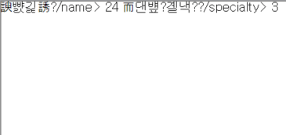
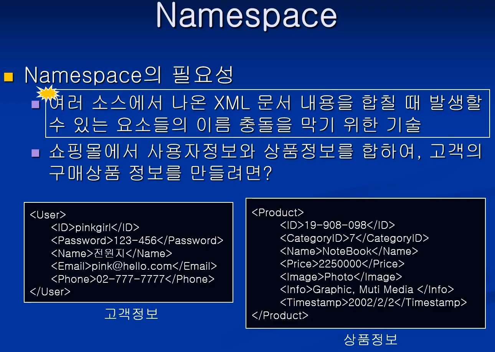
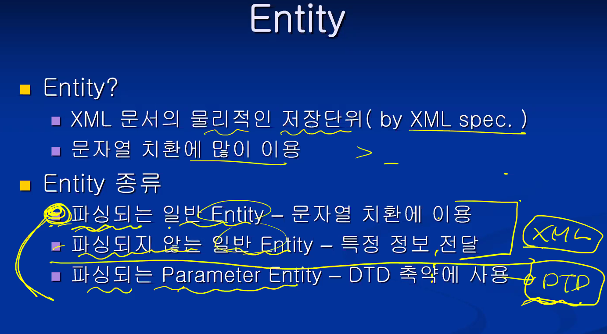
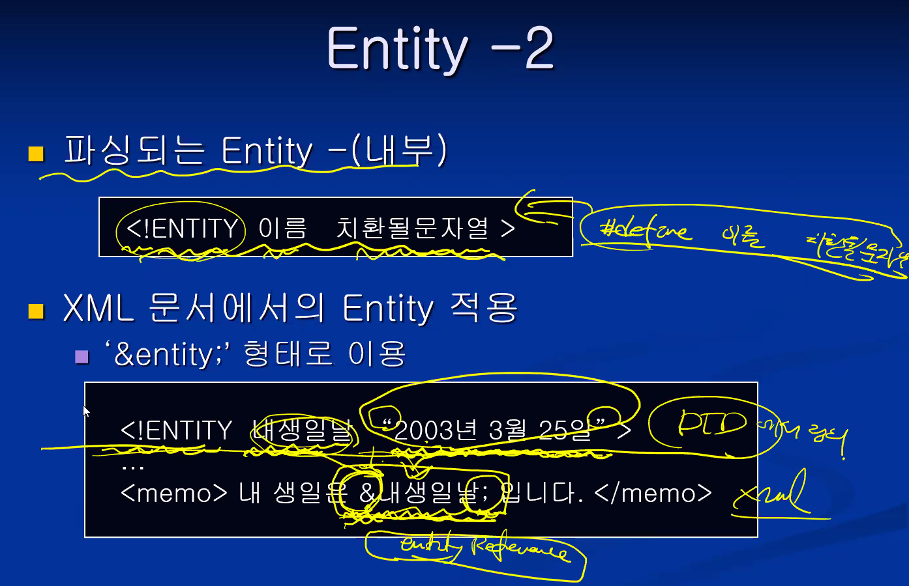

# 웹정보 프레임워크

<br/>

## Chapter 1, Introduction

### HTML의 문제점

* 문서의 구조나 의미(content)보다는 표현(presentation) 부분에 중점
  * 문서 처리의 자동화가 어려움
* <**태그**> <**/태그**> 로 구성되어있는 것을 XML에서는 **element**라고 한다.
* XML에서는 태그 안에 해당 정보를 포함한다.


<br/>

### XML

* **eXtensible Markup Language** ★

* SGML : 가장 포괄적인 마크업 언어
* XML : SGML의 기능들을 뽑아내서 만든 부분집합.
  * 비유하자면, SGML과 XML은 자료형으로 볼 수 있다. int, long, ...
* HTML : SGML을 적용시켜서 만든 언어 (인스턴스)
  * 비유하자면, HTML은 자료형에 대한 변수로 볼 수 있다. value, sum ...
  * 따라서 언어 자체에 대해서 XML과 HTML은 '비교 대상'은 아니다.

<br/>

### XML vs SGML vs HTML


* 문법적인 면에서 더 엄격한 경우, 오히려 심플하다고 볼 수 있다.
* **XML은 namespace를 지원한다!** ★
  * XML은 태그set을 정의할 수 있다. 
  * 그런데, 그것이 중복되지 않아야 해서 그 set을 구분하기 위해서 쓰는 것을 말한다.
  * Java를 예로들면 같은 이름의 class가 다른 것을 구분하기 위해 package 개념이 있듯

<br/>

**★ 암기★**


* 위에는 HTML, 아래는 XML의 속성값 표현 예시.
* **XML은 HTML과 다르게 태그 Set을 정의하여 사용 가능! ★**

<br/>

### XML의 장점


* **문서의 내용과 스타일을 분리하여 기술한다!** ★
  * 스타일은 css 와 같은 보여지는, presentation 부분

<br/>

### XML의 용도


* **문서로서의 기능과, XML이 국제 표준이기 때문에 OS 등이 달라도 시스템간 자료로서의 기능 또한 수행할 수 있다. ★**

<br/>

### XML 관련 도구


<br/>

### XML Overview


* Prolog
  * XML 문서 선언문 ( <?xml version="1.0" ... ?> ) 필수
  * PI 선택
  * DTD 선택
* Body
  * root element 태그 필수로 하나만 존재
  * content 루트 안의 내용들을 말함

* **위 문서의 구조는 ★ 암기사항 ★**

<br/>


* DTD는 내부/외부 Schema는 외부에만
* **Body 부분은 최상위 root element 하나만 나온다. ★**

<br/>


* 첫 줄 외우자! 버전까지는 반드시 나온다. 인코딩은 옵션.
* Prolog에서 PI는 생략된 코드. PI나 DTD는 생략 가능.
* students가 body의 root element

<br/>

### 실습 ex1-1)

* encoding="euc-kr" : ANSI 인코딩 형식
* encoding="utf-8" : 보편적인 한글 지원 인코딩 형식 
* 실제 코딩한 방식과 저장한 방식 선택이 같아야 한다

<br/>


<br/>

* 브라우저로 열어본 모습


* HTML과 다르게 XML은 보여지는 것보다 **'정보'를 표시하는 '형식'에 더 관심이 있는 언어**이기 때문에 이쁘게 나오지 않는 것이다!

<br/>

<br/>

* **암기★**


* Well-Formed XML 문서 ★
  * XML 1.0 표준안에 최소한의 규칙(기본 syntax)을 지키는 문서 ★
  * 다른 언어로 따지면 '컴파일 오류가 발생하지 않는 문서'
* Valid XML 문서 ★
  * Well-Formed에서 좀 더 진화한 형태. (Well-formed를 포함)
  * 사용자가 정의(user defined rule)한 DTD나 Schema의 규칙도 지키는 문서 ★

<br/>

### XML 인코딩

* XML은 Text 기반 Markup Language.
  * 문자 저장을 위한 encoding 방식을 XML 선언문에 직접 기술해야 함
* 여러 코드 체계
  * ASCII : 7bit (사실상 8bit)
  * EBCDIC : 8bit
    * IBM 등에서 사용
  * ISO-8859-1 : 8bit
    * 서유럽 문자 집합
  * EUC-KR : ASCII 문자들을 1byte로 표현 / 한글, 일어 등은 2byte로 표현
    * 나라마다 고유한 코드 체계임. 따라서 따로 설치해줘야 깨지지 않고 열어볼 수 있음.
    * 결국 전 세계적으로 호환되는 것은 unicode.

<br/>

### XML 인코딩 -2


* 반복하지만, 외우자. <?xml version="1.0" encoding="EUC-KR"?>
  * encoding 은 생략 가능. 생략시 default값은 UTF-8

<br/>

### 유니코드


* 유니코드의 경우, 문자 하나를 2바이트로 저장한다.
  * 따라서 알파벳의경우 앞에 0을 다 붙여줘야 해서, 메모리가 2배가 된다.
  * 그러다보니 알파벳 문화권에 있던 친구들이 메모리 낭비라고 생각해서 꼼수를 부렸음.
  * 표준안을 좀 바꿔서, 저장하는 방식을 나눴음. 그게 바로 UTF-8, UTF-16 등임
* UTF-8
  * 가변방식. ASCII 문자는 1byte로, 나머지는 2~6byte로 저장
  * 기존의 ASCII 코드체계와 호환이 되므로 기본적인 인코딩으로 보통 지정함
* UTF-16
  * 고정방식. ASCII 문자 포함하여 모든 문자를 2byte로 저장

### <br/>실습 ex1-2)

* encoding="euc-kr" : ANSI 인코딩 형식
* encoding="utf-8" : 보편적인 한글 지원 인코딩 형식 
* 실제 코딩한 방식과 저장한 방식 선택이 다르면 제대로 안나오는 걸 확인해보는 실습

<br/>


<br/>

* 브라우저로 열어본 모습



* 인코딩 형식이 다르므로 깨져서 나오는 것을 확인할 수 있다.

<br/>

## Chapter 2

### Well-Formed XML Document

<br/>

### Well-Formed XML 문서 규칙

* Well-Formed 하다? ★
  * XML 1.0 표준안에 정의된 문법 규칙을 따르는 것
* Well-Formed XML 문서의 요구사항 ★
  * 시작 Tag와 끝 Tag가 일치해야 한다
  * Root element는 오직 하나만 존재해야 한다
  * 태그 지정 시 대소문자를 구분한다.
  * 하부 요소는 중첩하여 사용할 수 없다. (무조건 parent - child. cross-over 불가)
  * 속성값은 반드시 "", '' 를 사용해야 한다.
  * 하나의 element에서 attribute를 반복하여 사용해서는 안된다.

<br/>

### Well-Formed XML Element


* Element
  * XML 문서의 내용을 이루는 기본 단위가 된다.
  * HTML처럼 끝 태그를 생략할 수 없다. 반드시 시작 Tag, 끝 Tag 쌍으로 써야한다

<br/>

```xml
예시)

<?xml version="1.0" encoding="euc-kr"?>
<Product>
	<ID>19-908-098</ID>
	<Name>NoteBook</Name>
	<Price>2250000</Price>
</Product>
```

* 부모 element인 Product가 ID, Name, Price등을 자식 element로 가진다.
* Tree 구조처럼 생각하면 될 듯 하다.

<br/>

* 반복!! Root element가 여러 개여서는 안된다. 에러 예시.

```xml
...
<Product>
	...
</Product>
<Product>
	...
</Product>
```

<br/>

* 태그는 중첩할 수 없다. 에러 예시!!

```xml
...
<Product>
	<ID> ... <CategoryID> ... </ID> <CategoryID>
</Product>
```

<br/>

### 실습 2-1) Well-Formed 규칙을 따르는 XML 문서 만들기

* 도서 목록을 XML 문서로 작성하시오.
  * 도서 목록(BookCatalog)는 여러 개(4~5)의 책(Book)을 가진다.
  * 책(Book)은 제목(Title), 저자(Author), 출판년도(Year)에 대한 정보(하위 요소)를 가진다.


<br/>

* 웹 브라우저로 본 모습


<br/>

### Well-Formed XML Tag


* Tag 이름 작성시 주의할 점 (위와 같이, 변수 이름 짓는 것과 비슷)
  * 시작은 문자(한글포함), '_' 로만 시작
  * 두 번째 문자부터는 일반 문자, '_', 숫자, '-', '.'도 가능 (태그 이름으로 :는 피하는게 좋다)
  * Tag이름에 공백 불가
  * 대소문자 구분
  * '<' 다음엔 공백 불가, '>' 전에는 공백 가능
  * Tag이름은 xml로 시작할 수 없다 ★

<br/>

### Well-Formed XML Attribute


* 속성(Attribute)?
  * Element에 부가적인 정보를 추가할 때 사용
  * attritube 이름, 'value' 가 쌍으로 생략되지 않고 나와야 한다.
  * value는 따옴표로 반드시 감싸줘야 한다.

<br/>

* Attribute 작성 규칙
  * 속성은 시작 Tag에서 지정해준다.
  * 속성은 속성 이름과 속성 값이 한 쌍으로 이루어져야 한다.
    * 속성값은 반드시 값을 가져야 한다. \<Name nickname> X
  * 속성값은 반드시 단일 따옴표나 이중 따옴표로 둘러싸야 한다.
    * \<People ID=691112-1683141 age=22> X
    * \<Song title="Alice's home"> O
  * 한 Tag내에 같은 속성을 두 번 이상 지정할 수 없다.
    * \<Name nickname="bear" nickname="tiger"> X

<br/>

### Well-Formed XML Comment


* 주석 형식
  * \<!-- 하이픈을 제외하고 아무거나 적어도 됨 --> 외우자! ★

<br/>

### Empty Element


* content가 없는 태그의 경우 '축약'해서 쓸 수 있다.
  * 끝 태그가 없는 것이 아니라 '축약'된 형태인 것!!

<br/>

### XML 문서의 선언

* 필수사항과 선택사항. version까지는 필수사항이므로 꼭 기억하자

<br/>

### Processing Instruction


* 외부 프로그램에게 알려주는 문장.
* 따라서 직접적으로 내부 내용과는 관련이 없다.

<br/>

### PCDATA vs. CDATA


* 문자열을 표현하는 것이라고 생각하면 된다. 다만 차이가 조금 있음.
* 일반 문자열의 경우에는 기본적으로 PCDATA라고 생각하면 된다.
* PCDATA
  * XML 파서가 해석할 수 있는 문자형 데이터를 말함
    * <, >, &, ", ' ... 등 의미가 부여되는 기호는 허용되지 않음
    * 이런 문자들은 &nbsp 처럼 entity reference로 기술해야 한다.
* CDATA
  * XML 파서에 의해 파싱되지 않는 데이터를 말함
    * 의미 부여가 되지 않으므로, 특수한 기호들도 마찬가지로 얼마든지 사용 가능
    * 단, 시작과 끝을 CDATA로 별도 표기해주어야 한다.

<br/>


<br/>


* 암기할 것!! ★

```xml
<tag><![CDATA[  파싱하지  말아야  될  데이터  ]]><tag>
```

<br/>

### 실습 2-3) CDATA 응용 북 카테고리 만들기

* xml 코드


<br/>

* 웹 브라우저로 본 모습


<br/>

### namespace ★



* Java에서 class 이름의 중복을 막기 위해 Package 개념을 도입한 것과 비슷하다.
* 여러 XML 문서 내용을 합칠 때 발생 가능한, 요소들의 이름 충돌을 막기 위한 기술

<br/>


* 위 예시의 경우, 상위 ID는 User를 위한 태그고 하위 ID는 Product를 위한 태그지만, 이름이 같아 충돌이 일어난다.

<br/>


* 임시로 쓰이는 별명을 접두사로 붙인다.
* 너무 긴 namespace를 매번 붙이기 번거로우니까 도입
  * Namespace:이름 - 고유성 보장
  * Prefix:이름 (별명) - 편리성
* xmlns(xml namespace)
* 임의의 문자열로 Unique 하기만 하면 되지만, 권장사항으로 URL로 해야 실질적으로 충돌이 발생할 가능성이 낮아 많이 사용한다. 
* "" 비어있는 URL로 한다면, namespace가 없는 녀석으로 인식한다.

<br/>


* 처음 사용하기 전에는 선언을 한 번 해주어야 한다.
* 시작 태그에 써준 별명은 반드시 끝 태그에도 써주어야 한다.
* prefix가 달라도 namespace URL 주소가 같으면 결국 같은 녀석으로 본다.
* URL 내용이 비어있으면, namespace가 없는 녀석으로 인식한다.

<br/>

### 실습 2-4) Namespace 정의

* 실습 2-1) 에서 작성한 BookCatalog.xml에서 Namespace를 정의하여 각 요소들 이름에 지정

* xml 코드


<br/>

* 웹 브라우저로 본 모습


<br/>


* xmlns:prefix 가 존재하지 않음 (기본적으로는 반드시 써주어야 함)
  * default namespace라고 함.
  * 선언된 시작 태그부터 하위의 모든 태그들은 해당 namespace를 사용

<br/>


* Namespace는 해당 요소 및 자손 요소들까지 적용.
* Default Namespace는 가까운 쪽에 선언된 것이 적용된다.
  * 위의 경우 상위 ID는 User에 선언된 namespace가, 하위 ID는 Product에 선언된 namespace가 적용 된다.

<br/>


<br/>

## Chapter 3. Valid XML Document

### 복습

* well formed XML DOC : 최소한의 규칙을 지키는 XML 문서
* Valid XML Document : well formed + user defined Rule 만족하는 XML 문서
  * Tag set 정의하는 방법
    * DTD (초기에 나온 방법)
    * XML Schema

<br/>

### XML 문서의 표준화


<br/>


* 위와 같은 그림 모델을 실제 규칙으로, DTD로 어떻게 작성할 것이냐? 를 이제 살펴볼 것!

<br/>

### DTD 필요성


* DTD : Document Type Definitions
* Valid 문서의 두 가지 조건 ★
  * Well-Formed XML 문서여야 함
  * DTD or XML Schema에 따라 XML 문서가 만들어져야 함

<br/>

### DTD 선언하기 ★ 암기


* \<!DOCTYPE 공백 없이 붙이기, 대소문자 구분, 반드시 root element 이름 [
* 내부 <!ELEMENT 부분이 바로 DTD 규칙이며, XML이 아닌 DTD 문법을 따른다.
* 외워야 합니다! 위 양식 암기부분 ★

<br/>

### 유효성 검증하기

* 웹 브라우저는 well formed만 검사하고, valid는 검사 못함
  * XML 파서가 필요하다.
  * 직접 다운로드 해서 설치하기!
  * 설치 후 웹 빈공간 우클릭 - validate XML

<br/>

### DTD Overview


* XML 문서 내부 DTD 정의 형식 외우기! ★

  * ```xml
    <!DOCTYPE RootElementName [
    	DTD 내용
    ]>
    ```

  * 따지고 보면 [ ] 대괄호 사이의 DTD 내용만 DTD syntax 이다.

  * 그 외 위 아래에 기술되어 있는 내용은 DTD가 아니다.

<br/>

### Element 선언


* 내부 DTD의 경우!

<br/>

#### 5가지 요소 유형 암기사항! ★

* 내용이 없는 Empty Element 선언

  * ```XML
    <!ELEMENT 요소이름 EMPTY>
    ```

  * EMPTY에 괄호 없음, 대문자

* 내용에 텍스트를 갖는 Element 선언

  * ```XML
    <!ELEMENT 요소이름 (#PCDATA)>
    ```

  * 괄호 열고, 대문자

* 내용에 하위요소를 갖는 Element 선언

  * ```XML
    <!ELEMENT 요소이름 (자손요소리스트)>
    ```

  * ( , , ... , , )

* 내용에 혼합 내용 모델을 갖는 Element 선언

  * ```XML
    <!ELEMENT 요소이름 MIXED모델>
    ```

* 내용에 모든 것(아무것)을 갖는 Element 선언

  * ```XML
    <!ELEMENT 요소이름 ANY>
    ```

  * 괄호 없음, 대문자

<br/>

### 다시 복습 DTD의 ELEMENT 선언하는 다섯가지 유형 ★

1. EMPTY
2. (#PCDATA)
3. ANY
4. (, , , )
5. MIXED 모델

<br/>

### Element Content - Empty element


<br/>

### Element Content - 하위 요소 element


<br/>


* 아래 내용이 DTD에 Valid 하다!

<br/>

### 실습 3-2) DTD 작성하기

* DTD 작성 코드


<br/>

* 유효성 검사 Validation successful!


<br/>

### Element Content - 하위 요소 지정 방식


<br/>


* 아래 내용이 DTD에 Valid 하다!

<br/>


* 아래 내용이 DTD에 Valid 하다!

<br/>

### Element Content - MIXED 모델


* 문자열과 하위 Element들이 여러 번 나오는 경우

* 양식 암기 ★

  * ```xml
    <!ELEMENT 요소이름 (#PCDATA | child1 | child2)*>
    ```

    * () 괄호 안에, #PCDATA가 가장 먼저 나오고 |로 구분, 괄호 밖에 마지막에 * 붙이기

<br/>


* 아래 내용이 DTD에 Valid 하다!

<br/>

### Element Content - ANY


<br/>


* 아래 내용이 DTD에 Valid 하다!

<br/>

### 실습 3-3) DTD 작성하기 - 2

* 작성 코드


<br/>

* 실행 결과


<br/>

#### 4주차 수업

* xxl 자동으로 동작..! XML이 아닌 것 처럼 동작함... 그래서 익스플로러에서 xml이 valid 안되는 경우가 있음

* DTD에서 속성이름에 ? 붙이는 것 : 해당 태그 생략가능

<br/>

### 외부 DTD

<br/>


* \<!DOCTYPE ... > 문장 제외하고 내부의 \<!ELEMENT ... > 선언 부분만 DTD 이다.
* 이 부분을 **따로 저장하면 이것이 바로 외부 DTD**. 아래 문장을 통해서 외부 DTD를 사용할 수 있다.
* **\<!DOCTYPE root요소이름 SYSTEM "파일명.dtd">**  (대소문자 구분)
* DTD는 내부에도 선언 가능하고, 외부에도 선언 가능 하지만, 뒤에서 배울 Schema는 외부로만 가능하다!

<br/>

### 실습 3-4) 외부 DTD 파일 만들기

* 작성 코드

```xml-dtd
<!ELEMENT BookCode (#PCDATA)>
<!ELEMENT Title (#PCDATA)>
<!ELEMENT Author (#PCDATA)>
<!ELEMENT CoAuthor (#PCDATA | Author)*>
<!ELEMENT Year (#PCDATA)>
<!ELEMENT Summary ANY >
<!ELEMENT Price ANY >
```

<br/>

* 외부 DTD를 선언하였으므로, 내부에는 작성하지 않는다.


<br/>

* 한글을 쓴 경우, "euc-kr" 방식으로 인코딩을 하고 싶을 때만 선언부를 포함한다.


<br/>

### Attribute 선언


* Attribute의 문법은 **\<!ATTLIST 요소이름 속성이름 속성유형 속성기본값>** 형태를 가진다. **암기 ★**
* Attribute 유형은 속성이 가질 수 있는 값의 타입을 말한다.
* Element에서는 **#PCDATA**가 기본이었으나, **Attibute**의 기본 타입은 **CDATA**가 기본이다.

<br/>

#### Built-in

```xml-dtd
<!ATTLIST 요소이름 속성이름 {속성유형} 속성기본값> 에서 속성 유형에 따른 속성값의 타입
```

* CDATA 일 때 속성값 : '문자열'
* ID 일 때 속성값 : '식별자'
* IDREF 일 때 속성값 : '식별자' reference
* IDREFS 일 때 속성값 : 여러 개의 '식별자' reference 들
* NMTOKEN 일 때 속성값 : 문법적 제한이 있는 'Token'
* NMTOKENS 일 때 속성값 : 여러 개의 'Token' 들
* ENTITY 일 때 속성값 : 'Entity'
* ENTITIES 일 때 속성값 : 여러 개의 'Entity' 들
  * 해당 차이들을 잘 인지하고 있음 된다.

<br/>


* 속성 기본 값은 넣어주지 않을 때 기본으로 들어가는 Default값을 말함
* 예시 **암기 ★**

<br/>

### 실습 3-5) Attribute 선언하기

* .dtd 파일에서 Book 요소 속성으로 lang 만들기
  * 속성유형 : 문자열 (CDATA)
* .xml 파일의 Book 요소에 lang 속성 넣고 valid 검사하기

```xml-dtd
<!ATTLIST Book lang CDATA "ko">
```

```xml
<Book lang="ko">
	...
</Book>
<!-- valid successful -->
```

<br/>

* DTD는 **ELEMENT** 선언과 **ATTLIST** 선언, **ENTITY** 선언 세 가지를 알면 다 아는 것이다!

<br/>


#### 속성값 Option

* 따로 없으면, **입력 안할 시 default**로 줄 속성값 / **생략 가능**
* **#FIXED** 속성값 : 무조건 해당 속성값 **고정**. 다른 값 입력시 invalid! (**예 : xml version="1.0"**) / **생략 가능**
  * 의미상으로 속성값을 고정으로 주는것이다.
* **#IMPLIED** : 무시 가능한 속성. 입력 하지 않으면 생략할 수 있다! / **생략 가능**
  * 의미상으로 속성값을 주는게 아니다.
* **#REQUIRED** : 미입력시 invalid! 반드시 값을 지정해 주어야 한다! / **생략 불가**
  * 의미상으로 속성값을 주는게 아니다.

<br/>

### 실습 3-6) 속성 기본값 Option

* .dtd 파일에서 lang 속성값을 #FIXED, #IMPLIED, #REQUIRED로 넣고 각각 빈칸, 임의의 값 등을 넣어보기
* .xml 파일의 Book 요소에 lang 속성 넣고 valid 검사하기


<br/>

* 작성 코드


* #FIXED의 경우
  * 값 생략 가능 - 생략 시 FIXED 값으로 들어감
  * 다른 값 넣으면 Error 발생 (invalid)


<br/>

* #IMPLIED
  * 값 생략 및 임의의 값 모두 가능


<br/>

* REQUIRED
  * 값 생략시 Error 발생 (invalid)


<br/>


* ID의 경우 Unique 해야한다! (= 중복 될 수 없다. 하나만 존재)
* 따라서 Default 값을 줄 수 없다. 반드시 뒤에 **#IMPLIED**, **#REQUIRED** 가 나와야 한다.
  * 아예 생략하거나, 반드시 하나만 필요하다.
* **숫자**나 '/' 등의 문자가 있으면 안된다. 변수 선언과 비슷함

<br/>

### 실습 3-7) Attribute - ID 속성값

* .dtd 파일에서 Book 요소의 속성으로 code를 작성. 속성유형은 ID로.
* .xml 파일의 Book 요소들 code 속성값을 중복시켜보고, #IMPLIED or #REQUIRED 생략해보기, 공백 넣어보기

<br/>

* 작성 코드

```xml-dtd
<!ATTLIST Book code ID #IMPLIED>
<!ATTLIST Book code ID #REQUIRED>
```

<br/>

* code 속성 값 중복 시 Error (invalid)


<br/>

* #IMPLIED or #REQUIRED 생략 시 Error (invalid)


<br/>

* 공백 포함 시 Error (invalid)


<br/>


* 다시 말하지만, **ID는 중복이 될 수 없다**.
* 하지만 IDREF는 중복 가능하다. 앞서 만든 ID를 Refference 하는 것!
* 따라서 **이미 존재하는 ID를 REF**해야한다. **없는 ID를 넣으면 invalid**!
* IDREF는 단수 개의 ID를 REF.한다

<br/>


* 복수 개를 표기한다. 속성값은 공백으로 구분한다.
* IDREFS는 복수 개의 ID를 REF한다

<br/>


<br/>


* 마찬가지로 변수 선언과 비슷하다.
* 공백을 포함하면 여러 개의 String으로 인지하므로 불가
* : 은 namespace로 사용하므로 비권장
* \<cover img="c://book.gif"> 에서 / 가 틀렸다!
* NMTOKEN은 단수, NMTOKENS는 복수개 가지는 것
* 이것 자체만은 별 의미가 없지만, 뒤에 Entity와 함께 쓰여 외부 어플에 정보를 전달할 때 사용한다.

<br/>


* CDATA도 아니고, ID도 아니고.. 열거된 해당 값만 가질 수 있다!
* (**원**, **달러**, **엔**) 이라는 값만 가능하다는 의미
* 프랑은 열거형에 나열된 값 중 존재하지 않으므로 가질 수 없다! Error!

<br/>

### 실습 3-8) Attribute 유형 - 열거형

* Book 요소의 하위요소로 Price 요소를 삽입, 속성으로 unit을 작성하고 열거형 (원/달러/엔/프랑)을 지정
* .xml 문서에서 unit에 속성값을 넣은 후 valid 검사

<br/>

* 작성 코드

```xml-dtd
<!ATTLIST Price unit (원 | 달러 | 엔 | 프랑) #IMPLIED>
```

<br/>

* 다른 값 "유로"를 넣었을 때 오류


<br/>

#### 앞서 공부한거 정리 해보자!

element 선언하는거!

```xml-dtd
<!ELEMENT element (EMPTY | #PCDATA | (child1, ...) | ANY | (#PCDATA | A | B)* )>
```

* \<!ELEMENT 태그이름 {유형} >
  * EMPTY
  * #PCDATA
  * (child1, child2, ... , child n) ...
  * ANY
  * MIXED : (#PCDATA | A | B)*

```xml-dtd
<!ATTLIST element att_name (CDATA | ID[REF[S]] | NMTKOEN[S] | 열거형) ("" | #IMPLIED | FIXED | REQUIRED)>
```

* \<!ATTLIST 태그이름 속성이름 {유형} 기본값 >
  * CDATA
  * ID[REF[S]]
  * NM...[S]
* \<!ATTLIST 태그이름 속성이름 유형 {기본값} >
  * "_____"
  * #IMPLIED
  * #FIXED
  * REQUIRED

<br/>

### Entity



* 첫 번째 문자열 치환이 가장 많이 사용된다고 한다. - **#define** 하고 똑같은 방식
* 위 두개는 XML에서 쓰이고, 아래꺼는 DTD에서 쓰이는 것

<br/>



* DTD에서 정의하는 부분, XML에서 사용되는 부분
* XML에서 쓰이는 것은, **\&를 붙이고, 끝에 ;을 붙인다**.

<br/>


* 위의 경우, 치환될 문자열의 내용이 외부 파일에 매칭되는 것이다.
* xml 선언문은 UTF-8로 저장하면 굳이 안써줘도 상관 없다.

<br/>


<br/>

### 실습 3-9) Entity 선언과 이용


