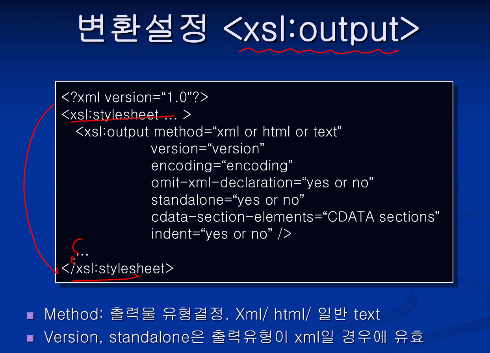
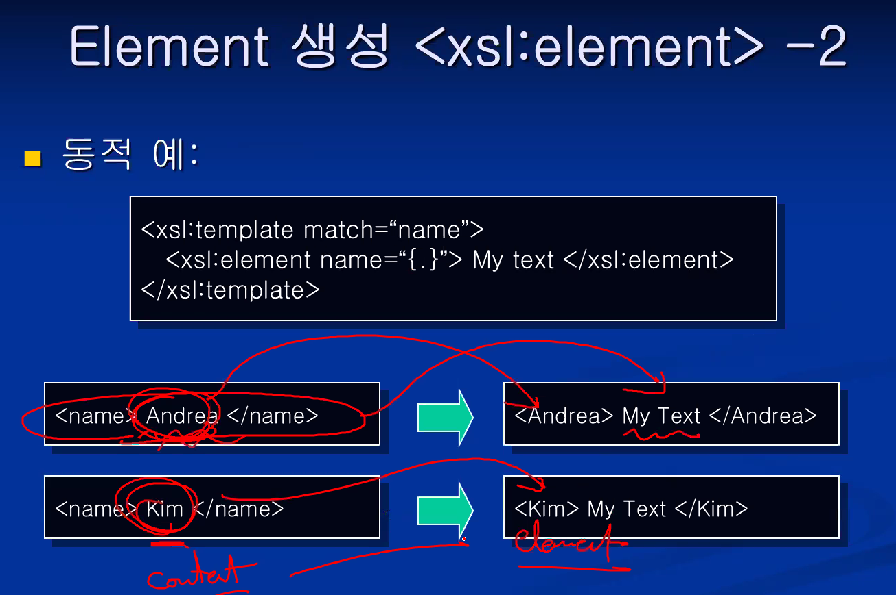
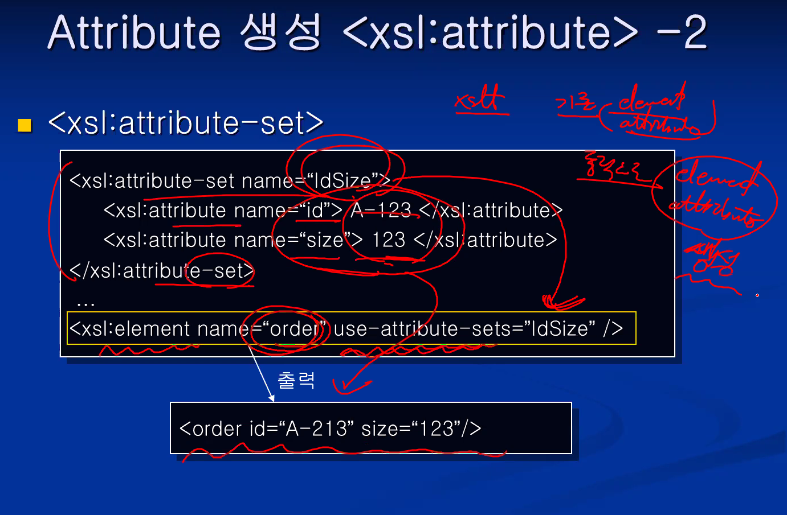
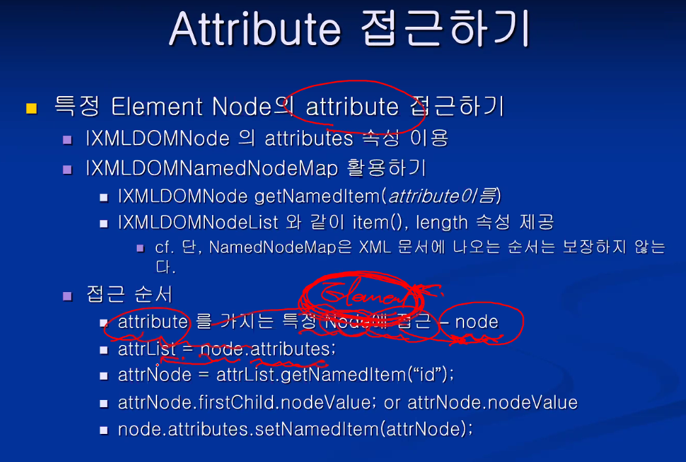

### 여러 개의 Schema 사용하기


* import 는 다른 스키마의 전역 선언만을 참조해서 '사용' 할 수 있도록 하는것
* include는 다른 스키마를 '포함' 하도록 하는 것 // namespace가 동일해야 한다!? 

* redefine는 미리 선언된 것을 '**재정의**'하도록 하는 것

<br/>


* 자바 패키지 import 하는 것과 같다고 생각하면 된다~
* 해당 패키지의 클래스를 '쓰는' 거지 바뀌지 않잖아.
* 그대로 **가져와서 사용하는 것**

<br/>


* 동일한 targetNamespace나, targetNamespace가 없는 문서만 사용 가능하다!
* 양자로 들인다고 생각하면 될 듯. 부모가 없거나, 나랑 같아야 데려올 수 있죠.
* 가져와서 **내 namespace로 포함시키는 것**.

<br/>


* 이미 선언되어 있는 target:songType 을 재정의 하는 것!
* 자바에서 상속을 받은 다음에 멤버변수를 추가하듯이.
* 그래서 사용할때는 target:SongType으로 하고, 정의할때는 name="SongType" 이렇게 써야 한다.
* **질문! redefine으로 가져와서 재정의 할 때, 그대로 가져와서 재정의하는 부분이  "추가"가 되는 건가요? 아니면 아예 "구현 자체를 새로" 하는건가요??** 

<br/>


<br/>

## Chapter 6. XML Translation - XSLT


* XML S/W 활용 방법 배울 것
  * SAX
  * DOM
* XML 응용 Part

<br/>

### 목차


<br/>

### XSLT?


* XSLT란 eXtensibl Stylesheet Language Transformation
* 이 시간 이후로 xsd는 이미 정의되어 있다고 가정하고 하자! 안써!

<br/>

### XSLT 문서 작성과 지정하기


* **암기할 것 ★**
* <xsl:stylesheet xmlns:xsl="http://www.w3.org/1999/XSL/Transform" version="1.0">
* xml 문서에서는 xsl-stylesheet 로, xsl 문서에서는 xsl:stylesheet로 쓰는 것이 최근 표준안이다.

<br/>

### XSLT 문서구조


* **암기!! 외우세요 첫 줄 ★**
* xsl:template match 에 해당하는 부분을, 맞는 요소 등을 찾아라.
* xml 문서에 대해 xslt를 써서 xml이나 html로 변환하여 출력한다.
* 이 때, match해서 찾는 그 부분이 출력 문장으로 나간다.

<br/>

### XSLT 맛보기


<br/>


* **\<xsl:stylesheet xmlns:xsl="http://www.w3.org/1999/XSL/Transform" version="1.0">**
* 첫 줄 외워서 쓰기 꼭 중요. stylesheet로 구성되어 있다.
* 디렉토리와 마찬가지로 xml 을 트리형태로 만들었을 때 경로를 / 로 표현한다.
* / 를 document root 라고 한다. 모든 xml의 가장 기본적인 root.
* / 아래에 root element가 달려있다.

<br/>

#### template match 부분의 코드를 확대해서 보자.


* 매치가 되면 템플릿 사이에 있는 결과물이 output으로 나온다.
* 그대로 나가는게 아니라, 아래 템플릿들을 적용해라! 라는 apply-templates 코드가 적용된다.
* XPath 인 "/제품/핸드폰" 에 해당하는 애들을 찾아서, 찾게 된 녀석들 각각에 대해서 템플릿을 적용해라!

<br/>

#### 적용할 템플릿의 match 부분


* 매치가 된 부분은 아래  match 에 대해 이런식으로 해라. 라는.. Mapping 하는 부분인 것 같다.
* 다시 얘기하지만, 순서대로 진행하는 것이 아니다!
* Xpath를 이용해서 match 시켜서 replace 한 다음 그걸 output으로 내는 것이다.

<br/>


<br/>

#### XSLT 돌려보는 사이트

* **[xslttest.appspot.com](http://xslttest.appspot.com/)**
* 브라우저 보기가 안되거나 오류가 있을 경우, 번거롭지만 위 사이트에서 하자.
* 하지만 실행 해 본 경험상 아래처럼 하면 되더라.
  * xml 파일에서는 xsl-stylesheet, xsl 파일에서는 xsl:stylesheet로 한다.
  * 익스플로러로 실행한다.
  * 크롬으로 보면 결과는 안나온다. 하지만, 코드 보기를 통해 xml 문서로는 보인다.

<br/>

### 실습 6-1) XSLT 돌려보기


<br/>

* **ex6_1_hp.xml 코드**

```xml
<?xml version="1.0"?>
<?xml-stylesheet type="text/xsl" href="ex6_1_hp.xsl"?>
<제품>
	<핸드폰>
		<모델명>SCH-X147</모델명>
		<통신사>SKT</통신사>
		<구입형태>기기변경</구입형태>
		<제조사>삼성전자</제조사>
		<색상>화이트</색상>
		<판매량 단위="개">30</판매량>
		<가격 화폐="원">253000</가격>
	</핸드폰>

	<핸드폰>
		<모델명>iphone 12</모델명>
		<통신사>SK</통신사>
		<구입형태>기기변경</구입형태>
		<제조사>Apple</제조사>
		<색상>화이트</색상>
		<판매량 단위="개">30</판매량>
		<가격 화폐="원">1253000</가격>
	</핸드폰>

	<핸드폰>
		<모델명>Galaxy Note 11</모델명>
		<통신사>SKT</통신사>
		<구입형태>기기변경</구입형태>
		<제조사>삼성전자</제조사>
		<색상>화이트</색상>
		<판매량 단위="개">30</판매량>
		<가격 화폐="원">1353000</가격>
	</핸드폰>

	<핸드폰>
		<모델명>Galaxy S12</모델명>
		<통신사>KT</통신사>
		<구입형태>기기변경</구입형태>
		<제조사>삼성전자</제조사>
		<색상>화이트</색상>
		<판매량 단위="개">30</판매량>
		<가격 화폐="원">1053000</가격>
	</핸드폰>

	<핸드폰>
		<모델명>CX-300L</모델명>
		<통신사>019</통신사>
		<구입형태>신규가입</구입형태>
		<제조사>LG전자</제조사>
		<색상>화이트</색상>
		<판매량 단위="개">30</판매량>
		<가격 화폐="원">270000</가격>
	</핸드폰>
</제품>
```

<br/>

* **ex6_1_hp.xsl 코드**

```xml
<?xml version="1.0"?>
<xsl:stylesheet xmlns:xsl="http://www.w3.org/1999/XSL/Transform" version="1.0">

<xsl:template match="/">
	<HTML>
	<HEAD>
		<TITLE>XML 문서의 내용을 테이블 형태로 보여주기</TITLE>
	</HEAD>
	<BODY>
		<BR/>
		<P align="center"><font color="#FA4C79" size="6">핸드폰 리스트</font></P>
		<BR/>
		<TABLE align="center" BORDER="0" cellpadding="5" cellspacing="2">
		<THEAD>
		<TR>
				<TH bgcolor="#0365B1"><font color="white">모델명</font></TH>
				<TH bgcolor="#0365B1"><font color="white">통신사</font></TH>
				<TH bgcolor="#0365B1"><font color="white">구입형태</font></TH>
				<TH bgcolor="#0365B1"><font color="white">제조사</font></TH>
				<TH bgcolor="#0365B1"><font color="white">색상</font></TH>
				<TH bgcolor="#0365B1"><font color="white">판매량</font></TH>
				<TH bgcolor="#0365B1"><font color="white">가격</font></TH>
		</TR>
		</THEAD>
		<TBODY>
				<xsl:apply-templates select = "/제품/핸드폰"/>
		</TBODY>
		</TABLE>
	</BODY>
	</HTML>
</xsl:template>

<xsl:template match = "/제품/핸드폰">
	<TR>
	<TD bgcolor="#DEE3EF"><p align="center" style="margin-top:3px;"><xsl:value-of select="모델명"/></p></TD>
	<TD bgcolor="#DEE3EF"><p align="center" style="margin-top:3px;"><xsl:value-of select="통신사"/></p></TD>
	<TD bgcolor="#DEE3EF"><p align="center" style="margin-top:3px;"><xsl:value-of select="구입형태"/></p></TD>
	<TD bgcolor="#DEE3EF"><p align="center" style="margin-top:3px;"><xsl:value-of select="제조사"/></p></TD>
	<TD bgcolor="#DEE3EF"><p align="center" style="margin-top:3px;"><xsl:value-of select="색상"/></p></TD>
	<TD bgcolor="#DEE3EF"><p align="center" style="margin-top:3px;"><xsl:value-of select="판매량"/></p></TD>
	<TD bgcolor="#DEE3EF"><p align="center" style="margin-top:3px;"><xsl:value-of select="가격"/></p></TD>
	</TR>
</xsl:template>

</xsl:stylesheet>
```

<br/>

#### Template 선언 \<xsl:template>


* xml 문서에서 찾아라! 하는 그 경로가 **Xpath** 이다.
* 이제 그걸 발견 하면 **매칭** 해서 출력문장으로 변환해서 Output으로 낸다.
* 출력 문장은 Markup Language여야 한다. 또, well-formed 해야 한다.
  * html, xml ... 등
* 다른 속성으로는 mode, priority(우선순위), name 등이 있다.

<br/>

### 실습 6-2) Match되는 template이 여러 개라면??


* **적용 순서!!** ★
  * 좀 더 정확하게 지정된 tamplate을 적용
    * "**/***" 보다 "**/제품**" 이 더 정확한 지정이다.
  * priority 순위가 더 큰 template을 적용
    * priority 옵션을 주었다면, 해당 속성이 높은 것이 수행된다.
  * 가장 나중에 오는 template을 적용
    * 코드 상에 **마지막에 오는 것**이 수행된다.
* 따라서 위 예제의 경우에는 가장 마지막 것이 수행된다.

<br/>

### XPath Pattern


* **/** : **XML document의 root** 이지, root element를 말하는게 아니다. ★ 
  * document root 아래에 root element가 달린다.
  * / 를 붙이면 절대 위치, 안붙이면 상대 위치를 의미한다.
* **XPath**로 매치가 되는게 단수가 아니라 **복수개인 경우가 많다**.
* ***** : **모든 요소**들을 지정하는 wild character 이다.
* **.** : 현재 요소. 현재 위치를 말한다.
  * 붙여도 되고 안붙여도 상관 없다.
* **..** : 부모 요소를 나타낸다.
  * 현재 위치와 형제관계 즉, sibling (DOM 에서 사용 된다) 관계가 된다.

<br/>


* **//** : **경로에 상관 없이** 후손들 중에 아무나 있으면 찾아라!
  * **"핸드폰//가격"** : 핸드폰의 자손 요소들 중 모든 가격 요소들을 지정
* **@** : **attribute**를 의미
  * **"가격/@단위"** : 현재  요소 아래 존재하는 가격 요소의 단위 attribute 지정
* **/ | * | @*** : **document root**나, **모든 요소**나, 모든 attribute를 의미

<br/>


* 조건 XPath Pattern
  * 요소를 찾은 다음, "조건식을 만족하는 **요소명**"을 찾는 것이다!!
  * 비교연산자, 논리연산자 사용 가능
  * **&lt** : **<**, less then 더 작은 것.
  * **&gt** : **>**, 더 큰 것.
* 특별하게 조건 없이 그냥 쓰면 하위 요소 중 **존재 여부가 조건**
  * **핸드폰[색상]** : 핸드폰 요소들 중, **색상 속성이 존재하는** 핸드폰 요소들만 지정
  * **핸드폰[4]** : 현재 요소의 하위 요소인 '핸드폰' 중 5번째 요소
* **핸드폰[index() \&lt; 3]** : 핸드폰 요소 중 처음에 오는 3개의 핸드폰 요소들 지정. (오타!) 0 1 2
* **핸드폰[last()]** : 마지막 핸드폰 요소 지정

<br/>


* 앞서 본 template은 match였다면, apply-templates는 select 이다. 찾아서 템플릿을 적용하라는 의미!
* 찾게 된 각각에 대해서 템플릿을 적용하게 된다.
* mode라는걸 지정해서 해당 모드에 맞는 템플릿이 적용되는데, 디버깅 할때 뭐 골라서 사용할 때..? 쓴다고.
* 위 왼쪽 경우
  * order가 현재 위치, requistion 부분이 output으로 나온다.
  * select가 없을 경우 현재 위치의 child-element 들에 대해서 템플릿이 적용한다고 보면 된다.
* 우측의 경우
  * select 된 item에 대해서 템플릿이 적용된다고 보면 된다.

<br/>

### 실습 6-3) XPath pattern 익히기


<br/>

* **ex6_1_hp.xml 코드**

```xml
<?xml version="1.0"?>
<?xml-stylesheet type="text/xsl" href="ex6_3_hp.xsl"?>
<제품>
	<핸드폰>
		<모델명>SCH-X147</모델명>
		<통신사>SKT</통신사>
		<구입형태>기기변경</구입형태>
		<제조사>삼성전자</제조사>
		<색상>화이트</색상>
		<판매량 단위="개">30</판매량>
		<가격 화폐="원">253000</가격>
	</핸드폰>

	<핸드폰>
		<모델명>iphone 12</모델명>
		<통신사>SK</통신사>
		<구입형태>신규가입</구입형태>
		<제조사>Apple</제조사>
		<색상>화이트</색상>
		<판매량 단위="개">30</판매량>
		<가격 화폐="원">123000</가격>
	</핸드폰>

	<핸드폰>
		<모델명>Galaxy Note 11</모델명>
		<통신사>SKT</통신사>
		<구입형태>기기변경</구입형태>
		<제조사>삼성전자</제조사>
		<색상>화이트</색상>
		<판매량 단위="개">30</판매량>
		<가격 화폐="원">1353000</가격>
	</핸드폰>

	<핸드폰>
		<모델명>Galaxy S12</모델명>
		<통신사>KT</통신사>
		<구입형태>기기변경</구입형태>
		<제조사>삼성전자</제조사>
		<색상>화이트</색상>
		<판매량 단위="개">30</판매량>
		<가격 화폐="원">153000</가격>
	</핸드폰>

	<핸드폰>
		<모델명>CX-300L</모델명>
		<통신사>019</통신사>
		<구입형태>신규가입</구입형태>
		<제조사>LG전자</제조사>
		<색상>화이트</색상>
		<판매량 단위="개">30</판매량>
		<가격 화폐="원">270000</가격>
	</핸드폰>
</제품>
```

<br/>

* **ex6_1_hp.xsl 코드**

```xml
<?xml version="1.0"?>
<xsl:stylesheet xmlns:xsl="http://www.w3.org/1999/XSL/Transform" version="1.0">

<xsl:template match="/">
	<HTML>
	<HEAD>
		<TITLE>XML 문서의 내용을 테이블 형태로 보여주기</TITLE>
	</HEAD>
	<BODY>
		<BR/>

		<!-- 1st table -->
		<P align="center"><font color="#FA4C79" size="6">핸드폰 리스트</font></P>
		<BR/>
		<TABLE align="center" BORDER="0" cellpadding="5" cellspacing="2">
		<THEAD>
		<TR>
				<TH bgcolor="#0365B1"><font color="white">모델명</font></TH>
				<TH bgcolor="#0365B1"><font color="white">통신사</font></TH>
				<TH bgcolor="#0365B1"><font color="white">구입형태</font></TH>
				<TH bgcolor="#0365B1"><font color="white">제조사</font></TH>
				<TH bgcolor="#0365B1"><font color="white">색상</font></TH>
				<TH bgcolor="#0365B1"><font color="white">판매량</font></TH>
				<TH bgcolor="#0365B1"><font color="white">가격</font></TH>
		</TR>
		</THEAD>
		<TBODY>
				<xsl:apply-templates select = "/제품/핸드폰"/>
		</TBODY>
		</TABLE>

		<!-- 2nd table -->
		<BR/>
		<TABLE align="center" BORDER="0" cellpadding="5" cellspacing="2">
		<THEAD>
		<TR>
				<TH bgcolor="#0365B1"><font color="white">모델명</font></TH>
				<TH bgcolor="#0365B1"><font color="white">통신사</font></TH>
				<TH bgcolor="#0365B1"><font color="white">구입형태</font></TH>
				<TH bgcolor="#0365B1"><font color="white">제조사</font></TH>
				<TH bgcolor="#0365B1"><font color="white">색상</font></TH>
				<TH bgcolor="#0365B1"><font color="white">판매량</font></TH>
				<TH bgcolor="#0365B1"><font color="white">가격</font></TH>
		</TR>
		</THEAD>
		<TBODY>
				<xsl:apply-templates select = "/제품/핸드폰[구입형태='신규가입']"/> <!-- 신규 가입인 핸드폰들 -->
		</TBODY>
		</TABLE>

		<!-- 3rd table -->
		<BR/>
		<TABLE align="center" BORDER="0" cellpadding="5" cellspacing="2">
		<THEAD>
		<TR>
				<TH bgcolor="#0365B1"><font color="white">모델명</font></TH>
				<TH bgcolor="#0365B1"><font color="white">통신사</font></TH>
				<TH bgcolor="#0365B1"><font color="white">구입형태</font></TH>
				<TH bgcolor="#0365B1"><font color="white">제조사</font></TH>
				<TH bgcolor="#0365B1"><font color="white">색상</font></TH>
				<TH bgcolor="#0365B1"><font color="white">판매량</font></TH>
				<TH bgcolor="#0365B1"><font color="white">가격</font></TH>
		</TR>
		</THEAD>
		<TBODY>
				<xsl:apply-templates select = "/제품/핸드폰[가격 &lt; 260000]"/> <!-- 가격이 26만원 이하인 핸드폰들 -->
		</TBODY>
		</TABLE>

	</BODY>
	</HTML>
</xsl:template>

<xsl:template match = "/제품/핸드폰">
	<TR>
	<TD bgcolor="#DEE3EF"><p align="center" style="margin-top:3px;"><xsl:value-of select="모델명"/></p></TD>
	<TD bgcolor="#DEE3EF"><p align="center" style="margin-top:3px;"><xsl:value-of select="통신사"/></p></TD>
	<TD bgcolor="#DEE3EF"><p align="center" style="margin-top:3px;"><xsl:value-of select="구입형태"/></p></TD>
	<TD bgcolor="#DEE3EF"><p align="center" style="margin-top:3px;"><xsl:value-of select="제조사"/></p></TD>
	<TD bgcolor="#DEE3EF"><p align="center" style="margin-top:3px;"><xsl:value-of select="색상"/></p></TD>
	<TD bgcolor="#DEE3EF"><p align="center" style="margin-top:3px;"><xsl:value-of select="판매량"/></p></TD>
	<TD bgcolor="#DEE3EF"><p align="center" style="margin-top:3px;"><xsl:value-of select="가격"/></p></TD>
	</TR>
</xsl:template>

</xsl:stylesheet>
```

<br/>

### 노드 값 \<xsl:value-of>


* 현재 위치 아래에 customer가 있고 그 id에 해당하는 attribute를 출력..
* 선택된 위치의 값을 출력해주는 태그
* \<xsl:value-of select="." /> : 현재 노드의 내용을 출력
* \<xsl:value-of select="./@id" /> : 현재 노드의 id attribute 값을 출력

<br/>

### 실습 6-4) template 적용하기


<br/>

* ex6_4_hp.xml 코드

```xml
<?xml version="1.0"?>
<?xml-stylesheet type="text/xsl" href="ex6_4_hp.xsl"?>
<simple>
	<name> John </name>
	<name> David </name>
	<name> Mark </name>
	<name> Kim </name>
	<name> Agatha </name>
	<name> Park </name>
</simple>
```

<br/>

* ex6_4_hp.xsl 코드

```xml
<?xml version="1.0"?>
<xsl:stylesheet xmlns:xsl="http://www.w3.org/1999/XSL/Transform" version="1.0">

<xsl:template match="/">
	<HTML>
	<HEAD>
		<TITLE>simple xslt example </TITLE>
	</HEAD>
	<BODY>
		<xsl:apply-templates select="simple/name" />
	</BODY>
	</HTML>
</xsl:template>

<xsl:template match="name">
	<p> <xsl:value-of select="."/> </p>
</xsl:template>

</xsl:stylesheet>
```

* xsl:template match="/" 로 우선 document root 를 매핑 해주어 HTML 양식으로 만든다.
* xsl:apply-templates select="simple/name" 으로 해당 위치의 name 요소들에 대해 각각 template 적용.
* xsl:template match="name" 으로 name 요소를 매핑해서 \<p> 태그 안에 선택된 요소의 value를 출력.
  * 현재 위치에서 select="." 하면 해당 값을 출력.

<br/>

### 변환설정 \<xsl:output>



* 출력되는 output 결과물에 대해 여러가지 정보를 추가해서 선택할 수 있다!

<br/>

### Numbering \<xsl:number>


* select 될 때 복수개일 가능성이 높다. 위에서 설명한 듯.

* 선택된 것들이 각각 템플릿이 적용되는데, 이 때 select된 것들이 넘어갈 때 인덱스를 표시해준다.

* 사용 형태

  * ```xml
    <!-- 출력되는 자리에 아래와 같은 형식으로 써준다. -->
    <xsl:number format="1"/>
    <xsl:number value="position()" format="I"/>
    <xsl:value-of select="position()" />
    ```

<br/>

### Sorting \<xsl:sort>


* 복수개를 찾았는데, 특정 기준으로 정렬하고 싶을 때

  * order : 순서!
    * ascending : 오름차순
    * discending : 내림차순
  * target : 기준!
    * 여러 개의 정렬 기준을 두려면 \<xsl:sort>를 여러 번 기술
  * dtype : 자료형 지정!
    * data-type="number" : 숫자로서 비교
    * test : 문자로서 비교 (default)

* 외부 템플릿(apply-templates), for-each(내부 템플릿) 안에서 사용

* 사용 형태

  * ```xml
    <xsl:apply-templates select = "/제품/핸드폰">
    	<xsl:sort order="ascending" select="//가격" data-type="number"/>
    <xsl:apply-templates select>
    ```

<br/>

### 실습 6-5) Numbering & Sorting


* 통신사로 오름차순, 
* 단, 위 경우 number로 하면 select 된 순서로 넘버링 된다. 이 경우 select="position()" 을 써주어야 한다.

<br/>

* ex6_5.xml 코드

```xml
<?xml version="1.0"?>
<?xml-stylesheet type="text/xsl" href="ex6_5.xsl"?>
<제품>
	<핸드폰>
		<모델명>SCH-X147</모델명>
		<통신사>SKT</통신사>
		<구입형태>기기변경</구입형태>
		<제조사>삼성전자</제조사>
		<색상>화이트</색상>
		<판매량 단위="개">30</판매량>
		<가격 화폐="원">253000</가격>
	</핸드폰>

	<핸드폰>
		<모델명>iphone 12</모델명>
		<통신사>KT</통신사>
		<구입형태>기기변경</구입형태>
		<제조사>Apple</제조사>
		<색상>화이트</색상>
		<판매량 단위="개">30</판매량>
		<가격 화폐="원">1253000</가격>
	</핸드폰>

	<핸드폰>
		<모델명>Galaxy Note 11</모델명>
		<통신사>SKT</통신사>
		<구입형태>기기변경</구입형태>
		<제조사>삼성전자</제조사>
		<색상>화이트</색상>
		<판매량 단위="개">30</판매량>
		<가격 화폐="원">1353000</가격>
	</핸드폰>

	<핸드폰>
		<모델명>Galaxy S12</모델명>
		<통신사>KT</통신사>
		<구입형태>기기변경</구입형태>
		<제조사>삼성전자</제조사>
		<색상>화이트</색상>
		<판매량 단위="개">30</판매량>
		<가격 화폐="원">1053000</가격>
	</핸드폰>

	<핸드폰>
		<모델명>CX-300L</모델명>
		<통신사>SKT</통신사>
		<구입형태>신규가입</구입형태>
		<제조사>LG전자</제조사>
		<색상>화이트</색상>
		<판매량 단위="개">30</판매량>
		<가격 화폐="원">200000</가격>
	</핸드폰>
</제품>
```

<br/>

* ex6_5.xsl 코드

```xml
<?xml version="1.0"?>
<xsl:stylesheet xmlns:xsl="http://www.w3.org/1999/XSL/Transform" version="1.0">

<xsl:template match="/">
	<HTML>
	<HEAD>
		<TITLE>XML 문서의 내용을 테이블 형태로 보여주기</TITLE>
	</HEAD>
	<BODY>
		<BR/>
		<P align="center"><font color="#FA4C79" size="6">핸드폰 리스트</font></P>
		<BR/>
		<TABLE align="center" BORDER="0" cellpadding="5" cellspacing="2">
		<THEAD>
		<TR>
				<TH bgcolor="#0365B1"><font color="white">순번</font></TH>
				<TH bgcolor="#0365B1"><font color="white">모델명</font></TH>
				<TH bgcolor="#0365B1"><font color="white">통신사</font></TH>
				<TH bgcolor="#0365B1"><font color="white">구입형태</font></TH>
				<TH bgcolor="#0365B1"><font color="white">제조사</font></TH>
				<TH bgcolor="#0365B1"><font color="white">색상</font></TH>
				<TH bgcolor="#0365B1"><font color="white">판매량</font></TH>
				<TH bgcolor="#0365B1"><font color="white">가격</font></TH>
		</TR>
		</THEAD>
		<TBODY>
				<xsl:apply-templates select = "/제품/핸드폰">
					<xsl:sort order="ascending" select="통신사"/>
					<xsl:sort order="descending" select="가격" data-type="number"/>
				</xsl:apply-templates>
		</TBODY>
		</TABLE>
	</BODY>
	</HTML>
</xsl:template>

<xsl:template match = "/제품/핸드폰">
	<TR>
	<!--<TD bgcolor="#DEE3EF"><p align="center" style="margin-top:3px;"><xsl:number format="1"/></p></TD>-->
	<TD bgcolor="#DEE3EF"><p align="center" style="margin-top:3px;"><xsl:value-of select="position()"/></p></TD>
	<TD bgcolor="#DEE3EF"><p align="center" style="margin-top:3px;"><xsl:value-of select="모델명"/></p></TD>
	<TD bgcolor="#DEE3EF"><p align="center" style="margin-top:3px;"><xsl:value-of select="통신사"/></p></TD>
	<TD bgcolor="#DEE3EF"><p align="center" style="margin-top:3px;"><xsl:value-of select="구입형태"/></p></TD>
	<TD bgcolor="#DEE3EF"><p align="center" style="margin-top:3px;"><xsl:value-of select="제조사"/></p></TD>
	<TD bgcolor="#DEE3EF"><p align="center" style="margin-top:3px;"><xsl:value-of select="색상"/></p></TD>
	<TD bgcolor="#DEE3EF"><p align="center" style="margin-top:3px;"><xsl:value-of select="판매량"/></p></TD>
	<TD bgcolor="#DEE3EF"><p align="center" style="margin-top:3px;"><xsl:value-of select="가격"/></p></TD>
	</TR>
</xsl:template>

</xsl:stylesheet>
```

<br/>

* 실행 결과!


<br/>

### XPath 함수들


* 유용한 함수들
  * count : 매칭되는 개수
    * \<xsl:value-of select="count(xpath)">
  * sum : 노드들의 합
    * \<xsl:value-of select="sum(xpath)">
  * number : 숫자로 변환해주는 것
    * \<xsl:value-of select="number(xpath)">
  * format-number : 패턴에 따라서 출력 해주는 것
    * \<xsl:value-of select="format-number(xpath)">
  * name : 현재 노드 이름, namespace 포함
    * \<xsl:value-of select="name()">
  * local-name : namespace 비포함
    * \<xsl:value-of select="local-name()">
  * text : 현재 노드 텍스트만 출력
    * \<xsl:value-of select="text()">

<br/>

### 실습 6-6) XPath 함수 이용하기


<br/>

* ex6_6.xml 코드

```xml
<?xml version="1.0"?>
<?xml-stylesheet type="text/xsl" href="ex6_6.xsl"?>
<제품>
	<핸드폰>
		<모델명>SCH-X147</모델명>
		<통신사>SKT</통신사>
		<구입형태>기기변경</구입형태>
		<제조사>삼성전자</제조사>
		<색상>화이트</색상>
		<판매량 단위="개">30</판매량>
		<가격 화폐="원">253000</가격>
	</핸드폰>

	<핸드폰>
		<모델명>iphone 12</모델명>
		<통신사>KT</통신사>
		<구입형태>기기변경</구입형태>
		<제조사>Apple</제조사>
		<색상>화이트</색상>
		<판매량 단위="개">30</판매량>
		<가격 화폐="원">1253000</가격>
	</핸드폰>

	<핸드폰>
		<모델명>Galaxy Note 11</모델명>
		<통신사>SKT</통신사>
		<구입형태>기기변경</구입형태>
		<제조사>삼성전자</제조사>
		<색상>화이트</색상>
		<판매량 단위="개">30</판매량>
		<가격 화폐="원">1353000</가격>
	</핸드폰>

	<핸드폰>
		<모델명>Galaxy S12</모델명>
		<통신사>KT</통신사>
		<구입형태>기기변경</구입형태>
		<제조사>삼성전자</제조사>
		<색상>화이트</색상>
		<판매량 단위="개">30</판매량>
		<가격 화폐="원">1053000</가격>
	</핸드폰>

	<핸드폰>
		<모델명>CX-300L</모델명>
		<통신사>SKT</통신사>
		<구입형태>신규가입</구입형태>
		<제조사>LG전자</제조사>
		<색상>화이트</색상>
		<판매량 단위="개">30</판매량>
		<가격 화폐="원">200000</가격>
	</핸드폰>
</제품>
```

<br/>

* ex6_6.xsl 코드

```xml
<?xml version="1.0"?>
<xsl:stylesheet xmlns:xsl="http://www.w3.org/1999/XSL/Transform" version="1.0">

<xsl:template match="/">
	<HTML>
	<HEAD>
		<TITLE>XML 문서의 내용을 테이블 형태로 보여주기</TITLE>
	</HEAD>
	<BODY>
		<BR/>
		<P align="center"><font color="#FA4C79" size="6">핸드폰 리스트</font></P>
		<BR/>
		<TABLE align="center" BORDER="0" cellpadding="5" cellspacing="2">
		<THEAD>
		<TR>
				<TH bgcolor="#0365B1"><font color="white">순번</font></TH>
				<TH bgcolor="#0365B1"><font color="white">모델명</font></TH>
				<TH bgcolor="#0365B1"><font color="white">통신사</font></TH>
				<TH bgcolor="#0365B1"><font color="white">구입형태</font></TH>
				<TH bgcolor="#0365B1"><font color="white">제조사</font></TH>
				<TH bgcolor="#0365B1"><font color="white">색상</font></TH>
				<TH bgcolor="#0365B1"><font color="white">판매량</font></TH>
				<TH bgcolor="#0365B1"><font color="white">가격</font></TH>
		</TR>
		</THEAD>
		<TBODY>
				<xsl:apply-templates select = "/제품/핸드폰">
					<xsl:sort order="ascending" select="통신사"/>
					<xsl:sort order="descending" select="가격" data-type="number"/>
				</xsl:apply-templates>
		</TBODY>
		</TABLE>

		<br/>
		<p align="center" style="margin-top:3px;">전체 <xsl:value-of select="count(/제품/핸드폰)"/>개의 상품이 검색되었습니다.</p>
		<p align="center" style="margin-top:3px;">현재 보유하고 있는 제품의 총 판매량은 <xsl:value-of select="sum(//판매량)"/>개 입니다.</p>

	</BODY>
	</HTML>
</xsl:template>

<xsl:template match = "/제품/핸드폰">
	<TR>
	<!--<TD bgcolor="#DEE3EF"><p align="center" style="margin-top:3px;"><xsl:number format="1"/></p></TD>-->
	<TD bgcolor="#DEE3EF"><p align="center" style="margin-top:3px;"><xsl:value-of select="position()"/></p></TD>
	<TD bgcolor="#DEE3EF"><p align="center" style="margin-top:3px;"><xsl:value-of select="모델명"/></p></TD>
	<TD bgcolor="#DEE3EF"><p align="center" style="margin-top:3px;"><xsl:value-of select="통신사"/></p></TD>
	<TD bgcolor="#DEE3EF"><p align="center" style="margin-top:3px;"><xsl:value-of select="구입형태"/></p></TD>
	<TD bgcolor="#DEE3EF"><p align="center" style="margin-top:3px;"><xsl:value-of select="제조사"/></p></TD>
	<TD bgcolor="#DEE3EF"><p align="center" style="margin-top:3px;"><xsl:value-of select="색상"/></p></TD>
	<TD bgcolor="#DEE3EF"><p align="center" style="margin-top:3px;"><xsl:value-of select="판매량"/></p></TD>
	<TD bgcolor="#DEE3EF"><p align="center" style="margin-top:3px;"><xsl:value-of select="format-number(가격,'###,##0')"/></p></TD>
	</TR>
</xsl:template>

</xsl:stylesheet>
```

<br/>

* 실행 결과


<br/>

### 앞서 배운...

* template match
* apply-template -> loop
* 뒤에 배울 for-each -> loop

<br/>

### 조건문 \<xsl:if>, \<xsl:choose>


* if 문
* test 속성을 써서 Boolean 식을 넣어서 조건문을 작성한다.
* 조건이 딱히 없이 이름만 쓰면, 현재 노드 기준으로 아래에 name이 존재하면 True, 없으면 False 이다.

<br/>


* switch 문과 비슷하다.
* 마찬가지 test 속성 = "조건"이 true면, 태그 안의 내용을 출력한다.
* 아래 코드는
  * salary의 내용을 숫자로 바꾸었을때의 내용이 2000보다 &gt(크면)  -> A big number 출력
* 

<br/>

### 실습 6-7) 조건문 사용하기


<br/>

* ex6_7.xml 코드

```xml
<?xml version="1.0"?>
<?xml-stylesheet type="text/xsl" href="ex6_7.xsl"?>
<제품>
	<핸드폰>
		<모델명>SCH-X147</모델명>
		<통신사>SKT</통신사>
		<구입형태>기기변경</구입형태>
		<제조사>삼성전자</제조사>
		<판매량 단위="개">30</판매량>
		<가격 화폐="원">253000</가격>
	</핸드폰>

	<핸드폰>
		<모델명>iphone 12</모델명>
		<통신사>KT</통신사>
		<구입형태>기기변경</구입형태>
		<제조사>Apple</제조사>
		<색상>화이트</색상>
		<판매량 단위="개">30</판매량>
		<가격 화폐="원">1253000</가격>
	</핸드폰>

	<핸드폰>
		<모델명>Galaxy Note 11</모델명>
		<통신사>SKT</통신사>
		<구입형태>기기변경</구입형태>
		<제조사>삼성전자</제조사>
		<색상>화이트</색상>
		<판매량 단위="개">30</판매량>
		<가격 화폐="원">1353000</가격>
	</핸드폰>

	<핸드폰>
		<모델명>Galaxy S12</모델명>
		<통신사>KT</통신사>
		<구입형태>기기변경</구입형태>
		<제조사>삼성전자</제조사>
		<판매량 단위="개">30</판매량>
		<가격 화폐="원">1053000</가격>
	</핸드폰>
	
	<핸드폰>
		<모델명>Galaxy S11</모델명>
		<통신사>KT</통신사>
		<구입형태>기기변경</구입형태>
		<제조사>삼성전자</제조사>
		<판매량 단위="개">20</판매량>
		<가격 화폐="원">953000</가격>
	</핸드폰>

	<핸드폰>
		<모델명>CX-300L</모델명>
		<통신사>SKT</통신사>
		<구입형태>신규가입</구입형태>
		<제조사>LG전자</제조사>
		<색상>화이트</색상>
		<판매량 단위="개">30</판매량>
		<가격 화폐="원">200000</가격>
	</핸드폰>
</제품>
```

<br/>

* ex6_7.xsl 코드

```xml
<?xml version="1.0"?>
<xsl:stylesheet xmlns:xsl="http://www.w3.org/1999/XSL/Transform" version="1.0">

<xsl:template match="/">
	<HTML>
	<HEAD>
		<TITLE>XML 문서의 내용을 테이블 형태로 보여주기</TITLE>
	</HEAD>
	<BODY>
		<BR/>
		<P align="center"><font color="#FA4C79" size="6">핸드폰 리스트</font></P>
		<BR/>
		<TABLE align="center" BORDER="0" cellpadding="5" cellspacing="2">
		<THEAD>
		<TR>
				<TH bgcolor="#0365B1"><font color="white">순번</font></TH>
				<TH bgcolor="#0365B1"><font color="white">모델명</font></TH>
				<TH bgcolor="#0365B1"><font color="white">통신사</font></TH>
				<TH bgcolor="#0365B1"><font color="white">구입형태</font></TH>
				<TH bgcolor="#0365B1"><font color="white">제조사</font></TH>
				<TH bgcolor="#0365B1"><font color="white">색상</font></TH>
				<TH bgcolor="#0365B1"><font color="white">판매량</font></TH>
				<TH bgcolor="#0365B1"><font color="white">가격</font></TH>
		</TR>
		</THEAD>
		<TBODY>
				<xsl:apply-templates select = "/제품/핸드폰"/>
		</TBODY>
		</TABLE>

	</BODY>
	</HTML>
</xsl:template>

<xsl:template match = "/제품/핸드폰">
	<TR>
	<!-- select 된 순서대로 넘버링 -->
	<!-- <TD bgcolor="#DEE3EF"><p align="center" style="margin-top:3px;"><xsl:number format="1"/></p></TD>	-->
	
	<!-- 출력되는 순서대로 넘버링, format을 로마자로 -->
	<TD bgcolor="#DEE3EF"><p align="center" style="margin-top:3px;"><xsl:number value="position()" format="I"/></p></TD>

	<TD bgcolor="#DEE3EF"><p align="center" style="margin-top:3px;"><xsl:value-of select="모델명"/></p></TD>
	<TD bgcolor="#DEE3EF"><p align="center" style="margin-top:3px;"><xsl:value-of select="통신사"/></p></TD>
	<TD bgcolor="#DEE3EF"><p align="center" style="margin-top:3px;"><xsl:value-of select="구입형태"/></p></TD>
	<TD bgcolor="#DEE3EF"><p align="center" style="margin-top:3px;"><xsl:value-of select="제조사"/></p></TD>
	<TD bgcolor="#DEE3EF">
		<xsl:if test="색상"><p align="center" style="margin-top:3px;"><xsl:value-of select="색상"/></p></xsl:if>
		<xsl:if test="not (색상)"><p align="center" style="margin-top:3px;">-</p></xsl:if>
	</TD>
<!--<TD bgcolor="#DEE3EF"><p align="center" style="margin-top:3px;">
		<xsl:choose>
			<xsl:when test="색상"><xsl:value-of select="색상"/></xsl:when>
			<xsl:otherwise>-</xsl:otherwise>
		</xsl:choose>
	</p></TD>
-->
	<TD bgcolor="#DEE3EF"><p align="center" style="margin-top:3px;"><xsl:value-of select="판매량"/></p></TD>
	<TD bgcolor="#DEE3EF"><p align="center" style="margin-top:3px;"><xsl:value-of select="format-number(가격,'###,##0')"/></p></TD>
	</TR>
</xsl:template>

</xsl:stylesheet>
```

<br/>

* 실행 결과


<br/>

### 반복문 \<xsl:for-each>


* apply-templates 을 사용하면 매번 반복하는 것 마다 외부에 또 선언을 해주어야 한다.
* for-each의 경우 내부 템플릿을 반복할 수 있다.
* names가 매치 되어 첫 번째 name에 대해서 first값이 출력되고, 이어서 두 번째 name의 firts가 출력된다.

<br/>

### Element 생성 \<xsl:element>


* 동적으로 tagset을 값으로 만들어서 사용하고 싶을 때

<br/>



* content를 element로 만들고 싶을 때
* 앞서 봤지만, {.} 는 현재 노드의 value를 의미한다.
* 즉, 매치가 일어난 name의 value를 이름으로 하는 element를 만드는 것이다.

<br/>

### 실습 6-8) Element 생성하기


<br/>

* ex6_8.xml 코드

```xml
<?xml version="1.0"?>
<?xml-stylesheet type="text/xsl" href="ex6_8.xsl"?>
<people>
	<name first="길동" last="홍"/>
	<name first="춘향" last="성"/>
	<name first="몽룡" last="이"/>
	<name first="향단" last="이"/>
</people>
```

<br/>

* ex6_8.xsl 코드

```xml
<?xml version="1.0"?>
<xsl:stylesheet xmlns:xsl="http://www.w3.org/1999/XSL/Transform" version="1.0">

<xsl:template match="/">
	<people>
		<xsl:apply-templates select="//name"/>
	</people>
</xsl:template>

<xsl:template match="name">
	<name>
		<xsl:apply-templates select="@*"/>
	</name>
</xsl:template>

<xsl:template match="@*">
	<xsl:element name="{local-name()}"> <xsl:value-of select="."/> </xsl:element>
</xsl:template>

</xsl:stylesheet>
```

<br/>

* 실행 결과


```xml
<?xml version="1.0" encoding="UTF-8"?>
<people>
    <name>
        <first>길동</first>
        <last>홍</last>
    </name>
    <name>
        <first>춘향</first>
        <last>성</last>
    </name>
    <name>
        <first>몽룡</first>
        <last>이</last>
    </name>
    <name>
        <first>향단</first>
        <last>이</last>
    </name>
</people>
```

<br/>

### Attribute 생성 \<xsl:attribute>


* 동적으로 attribute를 만드는 것!

<br/>



* XSLT에서 기존의 element, attribute 뿐 아니라 동적으로 element attribute도 생성할 수 있다는 의미!

<br/>

### 복사하기 


* XPath에 있는걸 copy 해서 그대로 복사해야 한다.
* But child나, attribute는 복사 되지 않는다.
* 현재 노드의 값만 복사 된다.
* copy-of 하고 value-of 하고는 조금 다르다~

<br/>

### XSLT & XPath 자료


<br/>

<br/>

## Chapter 7. XML Programming API 1 - DOM

앞서 XML을 HTML, XML, ML 등 다른 문서로 변환하는 것을 살펴보았다!


* SAX는 Java, DOM은 Javascript 로 할거야!

<br/>

### DOM?


* a set of Method signeture!
* DOM이라는 것 자체는 플랫폼과 랭귀지의 중립적인 인터페이스다!
* 문서의 내용과 구조, 스타일을 동적으로 접근하고, 수정할 수 있도록 도와주는 인터페이스다.
* 인터페이스 라고 하는 것은, 구현이 빠져있다는 것.
* 표준안에서는 함수에 대해 어떤 일을 한다는 선언만 있고, 구현 자체는 라이브러리를 만드는 회사에서..


* DOM은 인터페이스!! 자바에서 인터페이스를 생각하자.

<br/>

### DOM 실습환경


* 우리 수업에서는 윈도우 기본 제공 내에서!

<br/>

### DOM Tree 구조


* XML 파일이 파서에 의해서 읽혀진다.
* 그럼 파서가 메인 메모리에 Dom Tree를 만든다. (Document root)
  * 그 아래 Root Element가
    * Child Element가
      * Text가.. 달린다.
  * Dom Tree로 변환된다, **Dom Tree를 생성한다**. 라고 표현한다. ★
* 이 Dom Tree를 통해서 앱에서 읽고 쓰고 할 수 있는 것이다.
* 웹 보안 정책상, save는 지원이 안된다고 한다.

<br/>


* 구조를 알아야 한다! XML이 DOM Tree로 변환되고, 이걸로 원하는 정보를 읽고 쓰고 할거니까.
* root는 "/", Document root 이다.
  * 그 아래 **documentElement** 즉, root element가 존재한다.
    * 하위 요소들 Element 들이 존재할 수 있다.
      * Element가 문자열을 가질 때, **직접 바로 Value로 가지지 않고** 하위에 **Text 노드**라는게 있다. ★
      * 이 **Text 노드가 문자열을 가진다.** ★
      * **Attribute**도 마찬가지 하위에 **Text**를 가진다.
* Document 객체는 다른 개체들을 생성할 수 있다.
* **documentElement** root element. ★ 외우세요. root document가 가지는 property 중 하나!

<br/>


* 각 노드는 여러가지 역할을 가질 수 있다.
* Node 이자 Element이다.. 등등

<br/>


* Document
  * Document Element ("제품") - root element
    * Element ("핸드폰")
      * Element ("모델명")
        * Text ("SCH-X147")
* 각 노드들은 IXMLDOMNode를 지원하면서, 동시에 각자 속한.. Element는 IXMLDOMElement도 지원한다.

<br/>

### 실습 7-1) DOM Tree 구조 작성


<br/>

* DOM Tree 구조로 표현한 코드

```
0. document
	1. Element ("order")
		2. Attribute ("number")
			3. Text ("3123")
		2. Element ("date")
			3. Text("2002/1/1")
		2. Element ("customer")
			3. Attribute ("id")
				4. Text("216A")
			3. Text("Company A")
		2. Element ("item")
			3. Element ("part-number")
				4. Attribute ("warehouse")
					5. Text ("Warehouse 11")
				4. Text ("E16-25A")
			3. Element ("quantity")
				4. Text ("16")
```

<br/>

### DOM의 핵심 인터페이스 ★ 암기

* IXMLDOM___~ 형태로 만들어진다.


#### 핵심 object / interface ★ 다 외워야해

* **DOMDocument **★★★
  * **XML 문서 전체를 대표하는 DOM tree 최상위 node 객체**
  * 다른건 다 인터페이슨데, 얘만 인터페이스가 아닌 객체이다. object.
  * 인터페이스는 구현을 해야하는건데, 얘는 하나를 만들어야 한다.
  * 따라서 얘는 클래스이자 객체이다. 얘를 가지고 다른것들을 만들거나 할 수 있다.
* **XMLDOMNode**
  * tree 내의 독립적인 node를 나타냄. 가장 기본적인 Interface
  * 가장 **property**(마치 **member value처럼 '보인다'**)가 많고,  method가 많다.
    * setter, getter로 접근 가능하면 **property**라고 한다. (일종의 가상의 멤버변수)
    * 대신, 멤버 변수가 있는지 없는지는 중요하지 않다.
* **IXMLDOMNodeList**
  * Node들의 collection.
  * array라고 생각하면 된다. DOM Tree에 있는 복수개의 Node들
* **IXMLDOMElement**
  * element node 대표
* **IXMLDOMAttribute**
  * attribute node 대표
* **IXMLDOMText**, IXMLDOMCharacterData, IXMLDOMComment
  * 기본적으로 Text Data를 가지는 node 대표

<br/>

#### **외울 것들. 다시.**

- **DOMDocument** : 최상위 노드, 객체
- **IXMLDOMNode** : 각 노드
- **IXMLDOMNodeList** : 복수개 노드
- **IXMLDOMElement** : 요소 노드
- **IXMLDOMAttribute** : 속성 노드
- **IXMLDOMText** : 텍스트 데이터 노드


<br/>


* 앞에 DOM이나 IXMLDOM 은 생략되어있다.
* 각자 상속받는다는 것은, 하위 노드가 상위 노드를 지원한다는 의미이다.
* NodeList의 경우는 상속관계랑은 상관 없다.
* IXMLNode가 가장 중요하다. 다 외워야해

<br/>

#### DOM interface 상속관계

* Node	-	Node List
  * Document
  * Element
  * Attribute
  * CharacterData
    * Comment
    * Text
      * CDATASection

<br/>


* 위의 것들은 다 외워야 해..


```
IXMLDOMNode obj
- 자기 자신 표현 property (멤버 변수처럼 쓰는걸로 보인다)
obj.nodeType : 숫자 형태 0,1,2,3 ...
obj.nodeName : 
obj.nodeValue : Text일 때 의미가 있다.
	
	- .xml
	- .text
	
	
- 관계 (Tree)
attributes는 attrubutes라는 복수형으로 접근한다.
chlidNodes (보통 element나 text를 자식으로 가진다)
firstChild 첫 번째 자식 노드
Lastchild 마지막 자식 노드

형제관계
previousSibling 이전 형제
nextSibling 다음 형제

그리면서 다 써보자!!
```


<br/>

#### IXMLDOMNode ★★★ 핵심. 꼭 외우자.

**+: 읽고쓰기가능**

​	얘가 없는 것은 전부 읽기만 가능! Read Only

**\*: microsoft의 확장**


* **Properties**
  * **attributes**: 현재 node의 attribute 목록을 NameNodeMap 형식으로 반환
    * 복수형태
  * **childNodes: 모든 자식 node들을 NodeList 형식으로 반환**
    * 보통 element, text를 가진다.
  * **firstChild**: 첫번째 자식 node
  * **lastChild**: 마지막 자식 node
  * **nextSibling**: 현재 node의 다음 번에 위치한 형제 node반환
  * **nodeName**: 현재 node의 이름 (예: 요소의 경우 tag 이름)
  * **nodeType**: 현재 node의 type을 번호로 반환 (NODE_xxxx)
    * 1~5: ELEMENT, ATTRIBUTE, TEXT, CDATA_SECTION, ENTITY_REFERENCE
    * 6~10: ENTITY, PROCESSING_INSTRUCTION, COMMENT, DOCUMENT
    * 10~12: DOCUMENT_TYPE, DOCUMENT_FRAGMENT, NOTATION
  * **nodeTypeString***: node type을 문자열로 변환
    * microsoft의 확장? 표준은 아니래.
  * **nodeValue+**: 현재 node의 값 (text node일 때 의미가 있음)
    * Write 가능!!
  * **ownerDocument** : 현재 node를 포함하는 document 객체를 반환
    * DOM Tree의 root인, 최고 조상. DOMDocument를 반환하는 것이다.
  * **parentNode**: 현재 node의 부모 node를 반환
  * **previousSibling**: 현재 node의 이전 번에 위치한 형제 node 반환
  * **text*+**: 현재 node와 그 하위 node들이 가지고 있는 모든 텍스트내용 반환
    * 현재 노드를 Text 표현으로 반환
    * Write 가능!!
    * microsoft의 확장? 표준은 아니래.
  * **xml***: 현재 node와 그 하위 Node들의 XML 표현을 반환
    * 현재 노드를 XML 표현으로 반환
    * microsoft의 확장? 표준은 아니래.

<br/>

#### 외울 시간!!!

```
IXMLDOMNode

.ownerDocument : DOMDocument

자기 자신을 표현하는 property
.nodeType
.nodeName
.nodeValue

관계
.attributes 복수형
.chlidNodes 복수형
.firstChild
.lastChild

.previousSibling
.nextSibling

.text
.xml
```

<br/>

* 앞서 property는 정보를 읽는것에 집중해 있다면, Method는 구조를 바꾸고 내용을 바꾸는데 집중되어 있다.


* **methods** (함수)
  * **appendChild**: 현재 node의 자식 node 목록에 새 node를 끝에 추가
  * **cloneNode**: 현재 node를 복사하여 반환
  * **hasChildNodes**: 현재 node에 자식 node들이 있는지 여부 반환
  * **insertBefore**: 새 node를 지정된 하위 node 앞에 자식 node로 삽입
  * **removeChild**: 특정 자식 node를 자식 Node 목록에서 삭제하고 이 삭제된 node를 반환
  * **replaceChild**: 특정 자식 node를 새로운 node로 대체하고 교체된 node를 반환
  * **selectSingleNode\*, selectNodes\*: 현재 Node와 그 자식 node들에 있어서 지정된 Xpath를 만족시키는 노드(들)을 반환** ★★★
    * 얘는 정보를 읽는것!
    * **IXMLDOMNodeList**를 반환한다.
    * **굉장히 편리한 함수**입니다~
    * microsoft의 확장? 표준은 아니래.

<br/>


#### IXMLDOMNodeList

* properties (속성)
  * **item**: index를 인자로 받아서 해당 위치의 node 반환 (zero-based)
  * **length**: node 개수 반환
    * javascript에선 nodes[length-1] 배열처럼 접근해도 된당!

<br/>

* methods (함수)
  * reset: Iterator 위치를 reset
  * nextNode: iterator에서 다음 위치의 node 반환

<br/>

#### IXMLDOMNode에서 대부분 처리할 수 있으니까, 처리 못하는 것만 보면 된다.

<br/>


#### DOMDocument (IXMLDOMNode interface 상속)

* DOMDocument는 DOM Tree의 유일한 객체다.
  * 얘를 통해서 노드들을 생성할 수 있다.

* properties
  * doctype: 현재 문서에 대한 DTD를 정의하는 doctype node 반환
  * **documentElement+: DOM Tree의 root element 반환** ★
    * DOMDocument 객체가 파서 역할을 해준다!
    * Write 가능!
  * Implementation: 현재 문서에 대한 IXMLDOMImplementation 반환
  * **async*+**: 지정된 URL로부터 비동기적으로 다운로드 할지 여부 결정
    * Sync. 동기적으로 읽는다는 것은 load 했을 때, .xml 파일을 다 parsing 읽어서 DOMTree를 완성한 다음 Return 한다.
  * **readyState***: XML 문서의 현재 상태를 반환
    * DOM Tree가 완성되었는지 상태를 알 수 있는 것

<br/>

* **Methods**
  * **create???**: 해당 문서에 특정 node를 생성하는 Factory 함수들
    * ??? : Element, Attribute, CDATASection, Comment, EntityReference, ProcessingInstruction, TextNode
  * **getElementsByTagName**: 지정된 이름의 element 집합들의 반환 ★★★
    * **IXMLDOMNodeList** 형식으로 반환
  * **load***: 지정된 문자열을 XML 문서 내용으로 하여 DOM Tree 생성
    * 파일에서 읽어오는 것
  * **loadXML***: 지정된 문자열을 XML 문서내용으로 하여 DOM Tree 생성
    * 문자열에서 읽어오는 것
  * **save***: DOM Tree를 외부 파일로 저장
    * 얘는 

<br/>


* getElementsByTagName("elementName")
* selectNodes("//___") 
* 위 두개를 정말 많이 쓴다~!

<br/>

#### IXMLDOMElement (IXMLDOMNode interface 상속)

* properties
  * **tagName**: 현재 element의 태그 이름을 반환 == IXMLDOMNode에서 **nodeName**이다.
* methods
  * element에서는 attribute에 집중되어 있는 듯 하다. 하지만.. attributes를 통해 주로는 얻는다.
  * **getAttribute**: 주어진 이름의 attribute값 반환
  * **setAttribute**: attribute의 값을 지정
  * **getAttributeNode**: 주어진 이름의 attribute node 반환
  * **setAttributeNode**: 현재 요소에 새로운 attribute를 추가하거나 변경
  * **getElementsByTagName**: 지정된 이름의 element 집합들을 반환 ★★★
  * normalize: 인접한 여러 개의 text 노드들을 하나로 합침
  * **removeAttribute**: 주어진 이름의 attribute를 제거하거나 대체
  * **removeAttributeNode**: 주어진 attribute node를 제거

<br/>


#### IXMLDOMAttribute (IXMLDOMNode interface 상속)

* **properties**
  * **name**: attribute 이름을 반환
  * **value+**: attribute 값을 반환
* ★ element의 경우에는 firstchild(text) 노드를 거쳐서 nodevalue를 얻어야 값을 얻을 수 있다.
* ★ 하지만 attribute의 경우 그렇게 해도 되지만, 바로 attribute node에서 nodevalue를 해도 얻을 수 있다.

<br/>


#### IXMLDOMCharacterData

* properties
  * data**+**: 현재 node의 type에 따른 데이터(문자열)를 반환
  * length: 현재 데이터의 character 개수를 반환
* methods
  * **appendData**: nText.appendData(".") → "welcome" 에서 "welcome." 으로
  * **deleteData**: nText.deleteData(2, 4) → "welcome" 에서 "wee" 으로
  * **insertData**: nText.insertData(2, "!!") → "welcome" 에서 "we!!lcome" 으로
  * **replaceData**: nText.replaceData(2, 4, ".") → "welcome" 에서 "we.e" 으로..
  * **substringData**: nText.substringData(2, 4)  → "welcome" 중 "lcom" 반환
    * 위의 매개변수들은 (start, length) 형식이라고 한다.

<br/>

###  실습 7-2) DOM interface 이용하기


* element와 attribute node들의 이름과 text값을 얻기 위한 코드를 작성하시오.

<br/>

* 코드

```javascript
xmldoc.documentElement // root element
xmldoc.documentElement.childNodes[i] // root element의 자식 노드들 (element or text)
xmldoc.
```

<br/>


1. DOMDocument객체 xmldoc 생성
2. xmldoc에 XML 문서 내용 지정 (파일 or 문자열)
   * 이렇게 하면 파싱 해서 DOM Tree를 만든다.
3. xmldoc의 여러 properties나 methods를 이용해서 하위 요소들을 검색한다.
   * documentElement
   * childNodes
   * attributes
   * firstChild, lastChild
   * getElementsByTagName()
   * selectSingleNode(), selectNodes()

<br/>


* 기본적으론 DOM Tree 완성된 이후에 하는 것이 쉽다. 그래서 async = false 해줌.
* load는 되는데, save는 안됄겨

<br/>

### 실습 7-3) DOM 코드 확인하기


<br/>


<br/>

<br/>

#### 하위 Element 접근하기


<br/>


<br/>

#### 실습 7-4) 하위 Element 접근하기


<br/>

<br/>

#### 특정 Element 찾기


* () 든 []든 상관 없어요~
* 찾게된 것을 복수개로 받아와서 찾는것!
* getElementsByTagName() 은, tagName을 인자로 준다.
* selectNodes()는, XPath 형태로 들어간다. 차이 기억!

<br/>


<br/>

### 실습 7-5) 특정 Element 찾기


* getElementsByTagName() 이용 김홍신장
* selectNodes() 이용 김홍신장 출력

<br/>



* attibute는 text를 거치지 않아도 nodeValue 가능!
* 찾고자 할 때는 getNamedItem() 이 편함.
* 하나만 있을 때는 firstChild로 해도 되고..

<br/>


* attribute는 그냥 .nodeValue 해도 된다~.
* 먼저 element를 찾아라. 그 다음에 attributes를 찾아.

<br/>

### 실습 7-6) Attribute 접근하기


<br/>

### XML 문서 생성


* **Document 객체만** 생성 가능!!
  * Tree를 수정할 때 추가하려면 **create** 함수를 써줘야 한다.
* **IXMLDOMNode 의 메소드인 appendChilde** 등으로 원하는 위치에 삽입 가능하다.
* DOM tree를 save 하는건 보안 정책상 불가능하다.
  * 우린 alert 창으로 확인만.

<br/>


<br/>


* 우리가 해야할 게 DOMDocument가 있는데, 그 아래 root 노드 하나를 만든다.
* 그 다음 create 함수로 TextNode를 값을 주어 만든다.
* 만들기만 했지 아직 관계는 없었으니.., appendChild로 노드 관계를 만들어준다.
* 주의!! DOMDocument에 root를 달 때는, 하나만 달아야 하기 때문에, append하지 않는다.
* documentElement는 쓰기 가능. 따라서 documentElement property에 접근해서 준다.

<br/>

### 실습 7-7) Element 생성하기


<br/>


오우.. 사진좀..


* attributes는 append로 붙이지 않는다!
* node의 attributes.setNamedItem(attr) 형태로 붙인다.

<br/>


* 앞서 배운 내용들이 응용되어 사용된다.
* attribute는 text 거치지 않고 nodeValue 로 바로 접근 가능!

<br/>

### 실습 7-8) Attribute 생성하기


<br/>

<br/>

### 실습 7-9) XML 문서 생성


<br/>

<br/>